## 谷歌机器学习速成课程的目录
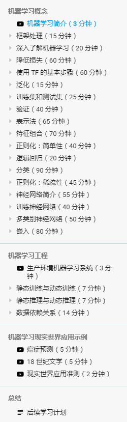

# 机器学习概念
## 机器学习简介
学习目标
+ 了解掌握机器学习技术的实际优势
+ 理解机器学习技术背后的理念

**机器学习与普通编程对比**

|机器学习的解决方案|普通编程的解决方案|
|-|-|
|**机器学习可以提供一个缩短编程时间的工具**。比如编写一个程序来纠正拼写错误，只需向现成的机器学习工具提供一些样本就可以在短时间内获得一个可靠的程序。|普通编程通过大量示例和经验法则，以及数周努力编写一个合理的程序。|
|**借助起学习可以自定义自己的产品，使其更适合特定的用户群体**。只需要收集该特定语言的数据，然后将数据提供给完全一样的机器学习模型学习，就可以提供多种语言版本的拼写检查程序。|手动编写了一个英文拼写纠错程序，如果打算针对100种最常用语言提供相应版本，这样一来每一种语言版本几乎都要从头开始，将付出数年的努力。|
|**借助机器学习可以解决不知道如何使用人工方法解决的问题**。比如识别出朋友的面孔，理解他们所说的话。|普通编程无法很好解决。|


## 框架处理
学习目标
+ 复习机器学习基本术语。
+ 了解机器学习的各种用途。
### 机器学习术语
|术语|解释|
|-|-|
|（监督式）机器学习？|机器学习系统通过学习如何组合输入信息来对从未见过的数据做出有用的预测。|
|标签|标签是我们要预测的事物，即简单线性回归中的$y$变量。标签可以是小麦未来的价格、图片中显示的动物品种、音频剪辑的含义或任何事物。|
|特征|特征是输入变量，即简单线性回归中的$x$变量。简单的机器学习项目可能会使用单个特征，而比较复杂的机器学习项目可能会使用数百万个特征，按如下方式指定：$x_1, x_2,...,x_N$。在垃圾邮件检测器示例中，特征可能包括：电子邮件文本中的字词、发件人的地址、发送电子邮件的时段、、电子邮件中包含“一种奇怪的把戏”这样的短语。|
|样本|样本是指数据的特定实例：$\pmb{x}$。（我们采用粗体$\pmb{x}$表示它是一个矢量。）我们将样本分为以下两类：有标签样本、无标签样本。**有标签样本**具有 {特征, 标签}：(x, y)， 用于训练模型。**无标签样本**具有 {特征, ?}：(x, ?)，用于对新数据做出预测。在我们的垃圾邮件检测器示例中，有标签样本是用户明确标记为“垃圾邮件”或“非垃圾邮件”的各个电子邮件。在使用有标签样本训练模型之后，我们会使用该模型预测无标签样本的标签。在垃圾邮件检测器示例中，无标签样本是用户尚未添加标签的新电子邮件。|
|模型|模型定义了特征与标签之间的关系。例如，垃圾邮件检测模型可能会将某些特征与“垃圾邮件”紧密联系起来。我们来重点介绍一下模型生命周期的两个阶段：训练是指创建或学习模型。也就是说，向模型展示有标签样本，让模型逐渐学习特征与标签之间的关系。推断是指将训练后的模型应用于无标签样本。|
|回归模型|回归模型可预测连续值。例如，回归模型做出的预测可回答如下问题：加利福尼亚州一栋房产的价值是多少？用户点击此广告的概率是多少？|
|分类模型|分类模型可预测离散值。例如，分类模型做出的预测可回答如下问题：某个指定电子邮件是垃圾邮件还是非垃圾邮件？这是一张狗、猫还是仓鼠图片？|
+ [机器学习术语表（网页）](https://developers.google.com/machine-learning/glossary/)
+ [机器学习术语表（PDF）](Google机器学习速成课程相关PDF资源/机器学习术语表GoogleDevelopers.pdf)
### 习题
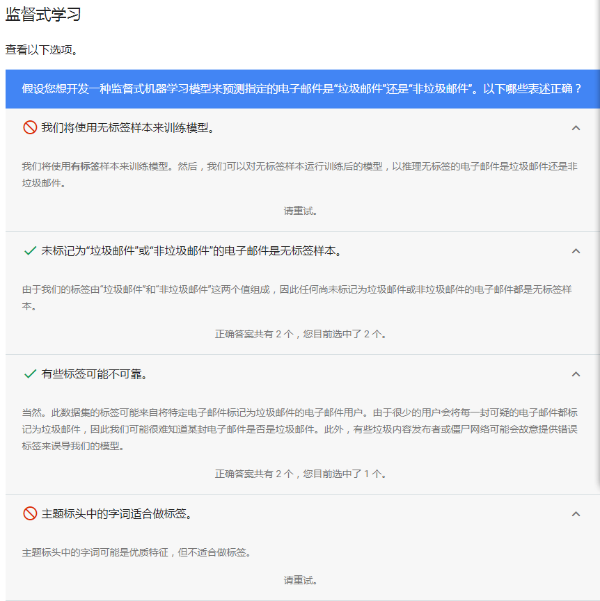
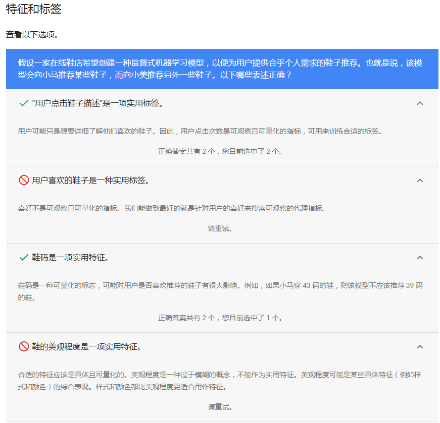

## 深入了解机器学习
学习目标
+ 复习前面学过的直线拟合知识。
+ 将机器学习中的权重和偏差与直线拟合中的斜率和偏移关联起来。
+ 大致了解“损失”，详细了解平方损失。
### 线性回归
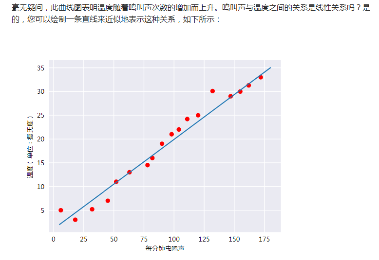

### 训练与损失
简单来说，训练模型表示通过有标签样本来学习（确定）所有权重和偏差的理想值。在监督式学习中，机器学习算法通过以下方式构建模型：检查多个样本并尝试找出可最大限度地减少损失的模型；这一过程称为经验风险最小化。

损失是对糟糕预测的惩罚。也就是说，损失是一个数值，表示对于单个样本而言模型预测的准确程度。如果模型的预测完全准确，则损失为零，否则损失会较大。训练模型的目标是从所有样本中找到一组平均损失“较小”的权重和偏差。例如，图 3 左侧显示的是损失较大的模型，右侧显示的是损失较小的模型。关于此图，请注意以下几点：
+ 红色箭头表示损失。
+ 蓝线表示预测。
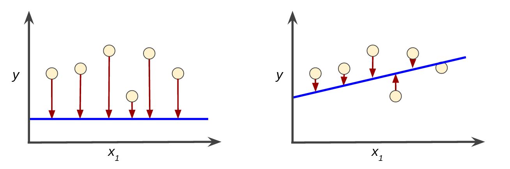
请注意，左侧曲线图中的红色箭头比右侧曲线图中的对应红色箭头长得多。显然，相较于左侧曲线图中的蓝线，右侧曲线图中的蓝线代表的是预测效果更好的模型。
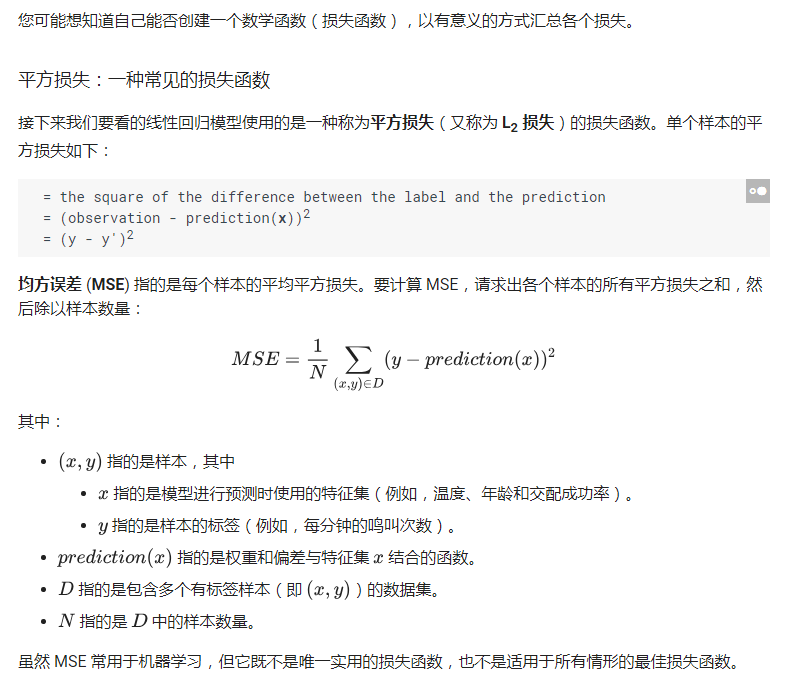
### 习题
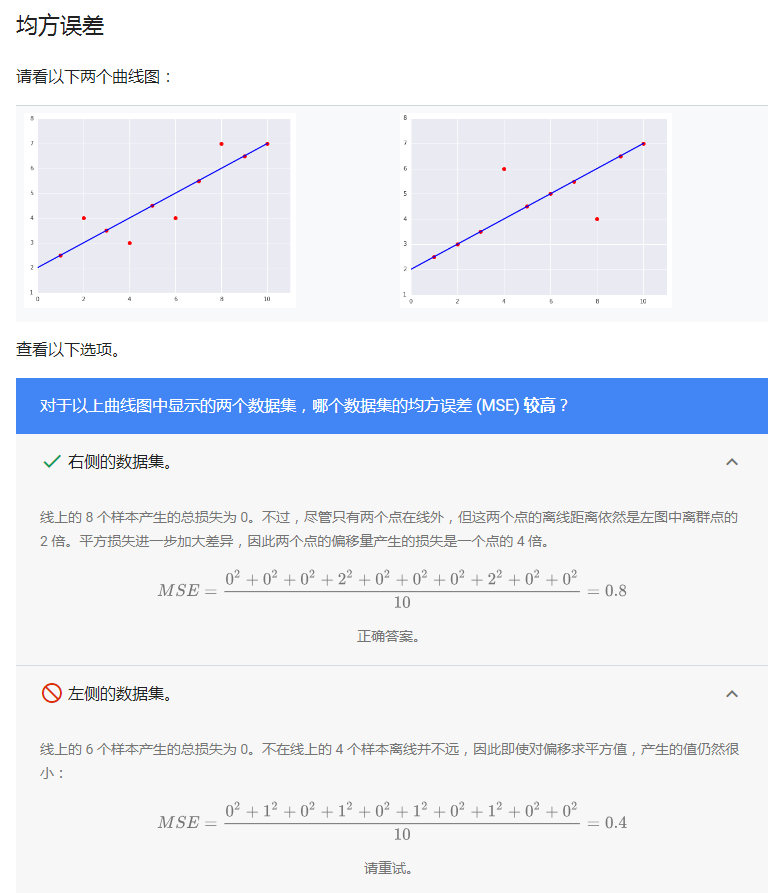

## 降低损失
学习目标
+ 了解如何使用迭代方法来训练模型。
+ 全面了解梯度下降法和一些变体，包括：小批量梯度下降法、随机梯度下降法。
+ 尝试不同的学习速率。
### 迭代方法
下图显示了机器学习算法用于训练模型的迭代试错过程：
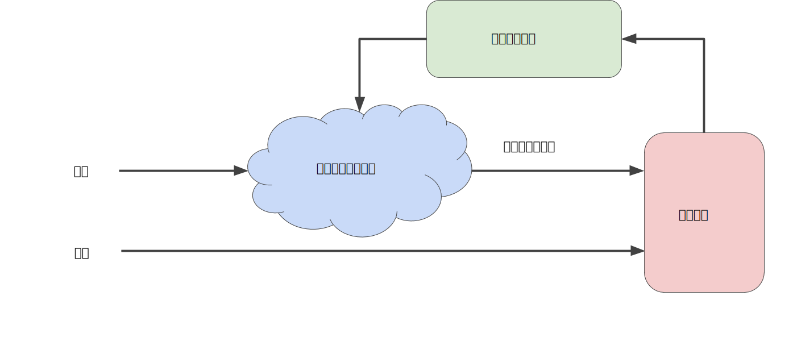
### 随机梯度下降法
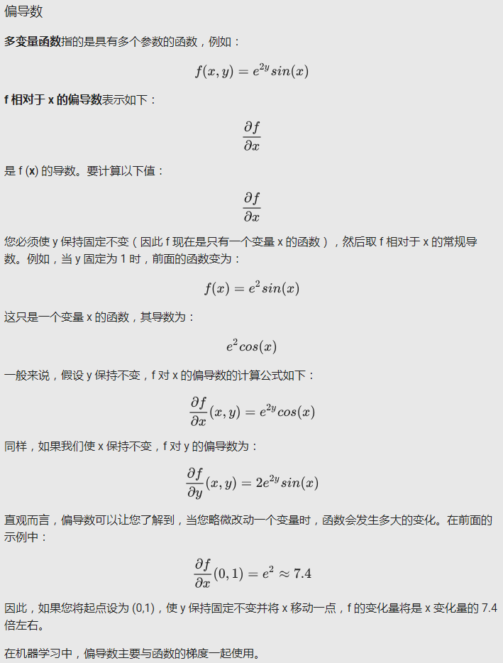
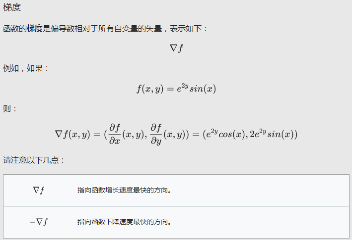
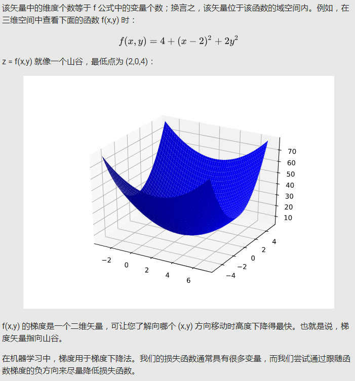
请注意，梯度是一个矢量，因此具有以下两个特征：方向、大小。
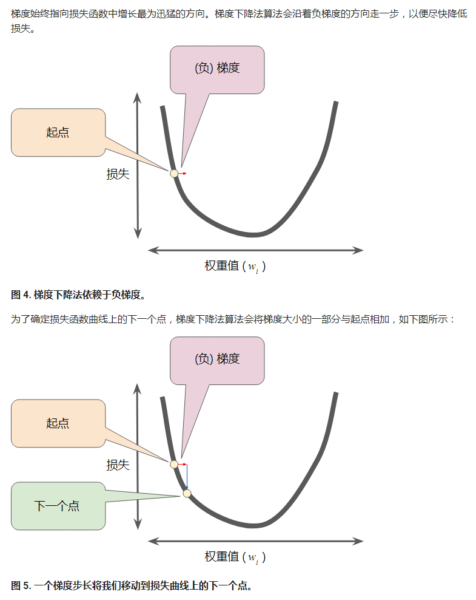
### 学习速率
正如之前所述，梯度矢量具有方向和大小。梯度下降法算法用梯度乘以一个称为学习速率（有时也称为步长）的标量，以确定下一个点的位置。例如，如果梯度大小为 2.5，学习速率为 0.01，则梯度下降法算法会选择距离前一个点 0.025 的位置作为下一个点。

超参数是编程人员在机器学习算法中用于调整的旋钮。大多数机器学习编程人员会花费相当多的时间来调整学习速率。如果您选择的学习速率过小，就会花费太长的学习时间：
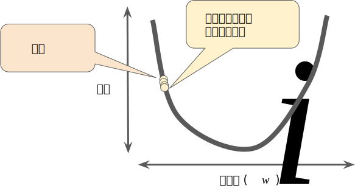
相反，如果您指定的学习速率过大，下一个点将永远在 U 形曲线的底部随意弹跳，就好像量子力学实验出现了严重错误一样:
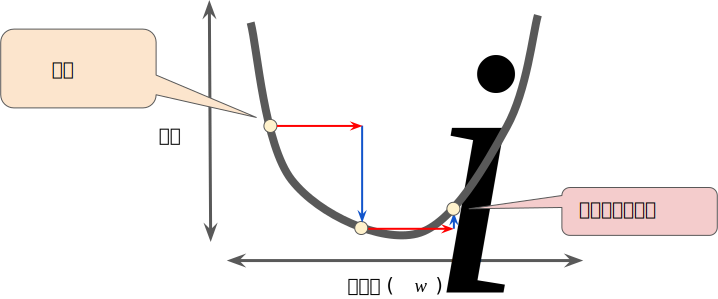
每个回归问题都存在一个金发姑娘学习速率。“金发姑娘”值与损失函数的平坦程度相关。如果您知道损失函数的梯度较小，则可以放心地试着采用更大的学习速率，以补偿较小的梯度并获得更大的步长。
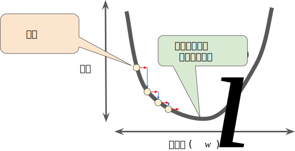
> 注意：在实践中，成功的模型训练并不意味着要找到“完美”（或接近完美）的学习速率。我们的目标是找到一个足够高的学习速率，该速率要能够使梯度下降过程高效收敛，但又不会高到使该过程永远无法收敛。

### 随机梯度下降法
在梯度下降法中，**批量** 指的是用于在单次迭代中计算梯度的样本总数。到目前为止，我们一直假定批量是指整个数据集。就 Google 的规模而言，数据集通常包含数十亿甚至数千亿个样本。此外，Google 数据集通常包含海量特征。因此，一个批量可能相当巨大。如果是超大批量，则单次迭代就可能要花费很长时间进行计算。

包含随机抽样样本的大型数据集可能包含冗余数据。实际上，批量大小越大，出现冗余的可能性就越高。一些冗余可能有助于消除杂乱的梯度，但超大批量所具备的预测价值往往并不比大型批量高。

如果我们可以通过更少的计算量得出正确的平均梯度，会怎么样？通过从我们的数据集中随机选择样本，我们可以通过小得多的数据集估算（尽管过程非常杂乱）出较大的平均值。**随机梯度下降法(SGD)** 将这种想法运用到极致，它每次迭代只使用一个样本（批量大小为 1）。如果进行足够的迭代，SGD 也可以发挥作用，但过程会非常杂乱。“随机”这一术语表示构成各个批量的一个样本都是随机选择的。

**小批量随机梯度下降法（小批量 SGD）** 是介于全批量迭代与 SGD 之间的折衷方案。小批量通常包含 10-1000 个随机选择的样本。小批量 SGD 可以减少 SGD 中的杂乱样本数量，但仍然比全批量更高效。
### 习题
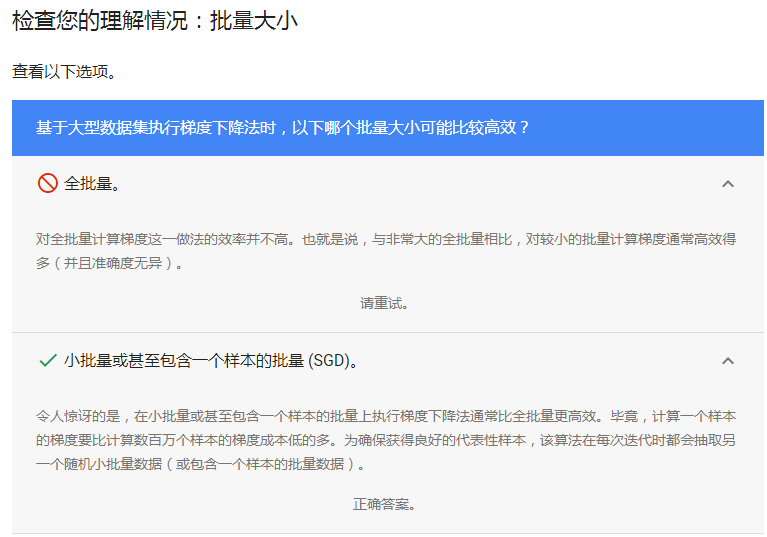

## 使用TensorFlow的基本步骤
https://www.tensorflow.org/

TensorFlow 由以下两个组件组成：图协议缓冲区、执行（分布式）图的运行时。
这两个组件类似于 Java 编译器和 JVM。正如 JVM 会实施在多个硬件平台（CPU 和 GPU）上一样，TensorFlow 也是如此。

> Java编译器：将Java源文件（.java文件）编译成字节码文件（.class文件，是特殊的二进制文件，二进制字节码文件），这种字节码就是JVM的“机器语言”。javac.exe可以简单看成是Java编译器。
VM：够运行Java字节码（Java bytecode）的虚拟机。[more](https://jingyan.baidu.com/article/b0b63dbf2dbf234a483070c3.html)

我们将使用 tf.estimator 来完成机器学习速成课程中的大部分练习。您在练习中所做的一切都可以在较低级别（原始）的 TensorFlow 中完成，但使用 tf.estimator 会大大减少代码行数。

tf.estimator 与 scikit-learn API 兼容。 scikit-learn 是极其热门的 Python 开放源代码机器学习库，拥有超过 10 万名用户，其中包括许多 Google 员工。

概括而言，以下是在 tf.estimator 中实现的线性回归程序的格式：
```
import tensorflow as tf

# Set up a linear classifier.
classifier = tf.estimator.LinearClassifier()

# Train the model on some example data.
classifier.train(input_fn=train_input_fn, steps=2000)

# Use it to predict.
predictions = classifier.predict(input_fn=predict_input_fn)
```
### 编程练习
请按照指定顺序运行以下三个练习：
|名称|说明|文件|
|-|-|-|
|Pandas 简介|Pandas 是用于进行数据分析和建模的重要库，广泛应用于 TensorFlow 编码。该教程提供了学习本课程所需的全部 Pandas 信息。如果您已了解 Pandas，则可以跳过此练习。|[intro_to_pandas.ipynb](Google机器学习速成课程Code/intro_to_pandas.ipynb)|
|使用 TensorFlow 的起始步骤|此练习介绍了线性回归。|[first_steps_with_tensor_flow.ipynb](Google机器学习速成课程Code/first_steps_with_tensor_flow.ipynb)|
|合成特征和离群值|此练习介绍了合成特征以及输入离群值带来的影响。|[synthetic_features_and_outliers.ipynb](Google机器学习速成课程Code/synthetic_features_and_outliers.ipynb)|

## 泛化
学习目标
+ 直观理解过拟合。
+ 确定某个模型是否出色。
+ 将数据集划分为训练集和测试集。
### 过拟合的风险
过拟合模型在训练过程中产生的损失很低，但在预测新数据方面的表现却非常糟糕。如果某个模型在拟合当前样本方面表现良好，那么我们如何相信该模型会对新数据做出良好的预测呢？正如您稍后将看到的，过拟合是由于模型的复杂程度超出所需程度而造成的。机器学习的基本冲突是适当拟合我们的数据，但也要尽可能简单地拟合数据。

机器学习的目标是对从真实概率分布（已隐藏）中抽取的新数据做出良好预测。遗憾的是，模型无法查看整体情况；模型只能从训练数据集中取样。如果某个模型在拟合当前样本方面表现良好，那么您如何相信该模型也会对从未见过的样本做出良好预测呢？

奥卡姆的威廉是 14 世纪一位崇尚简单的修士和哲学家。他认为科学家应该优先采用更简单（而非更复杂）的公式或理论。奥卡姆剃刀定律在机器学习方面的运用如下：
> 机器学习模型越简单，良好的实证结果就越有可能不仅仅基于样本的特性。

现今，我们已将奥卡姆剃刀定律正式应用于统计学习理论和计算学习理论领域。这些领域已经形成了泛化边界，即统计化描述模型根据以下因素泛化到新数据的能力：
+ 模型的复杂程度
+ 模型在处理训练数据方面的表现

虽然理论分析在理想化假设下可提供正式保证，但在实践中却很难应用。机器学习速成课程则侧重于实证评估，以评判模型泛化到新数据的能力。

机器学习模型旨在根据以前未见过的新数据做出良好预测。但是，如果您要根据数据集构建模型，如何获得以前未见过的数据呢？一种方法是将您的数据集分成两个子集：
+ 训练集 - 用于训练模型的子集。
+ 测试集 - 用于测试模型的子集。

一般来说，在测试集上表现是否良好是衡量能否在新数据上表现良好的有用指标，前提是：

+ 测试集足够大。
+ 您不会反复使用相同的测试集来作假。


以下三项基本假设阐明了泛化（监督式机器学习关键假设）：

+ 我们从分布中随机抽取独立同分布 (i.i.d) 的样本。换言之，样本之间不会互相影响。（另一种解释：i.i.d. 是表示变量随机性的一种方式）。
+ 分布是平稳的；即分布在数据集内不会发生变化。
+ 我们从同一分布的数据划分中抽取样本。

在实践中，我们有时会违背这些假设。例如：
+ 想象有一个选择要展示的广告的模型。如果该模型在某种程度上根据用户以前看过的广告选择广告，则会违背 i.i.d. 假设。
+ 想象有一个包含一年零售信息的数据集。用户的购买行为会出现季节性变化，这会违反平稳性。

如果违背了上述三项基本假设中的任何一项，那么我们就必须密切注意指标。

总结：
+ 如果某个模型尝试紧密拟合训练数据，但却不能很好地泛化到新数据，就会发生过拟合。
+ 如果不符合监督式机器学习的关键假设，那么我们将失去对新数据进行预测这项能力的重要理论保证。

## 训练集和测试集
上一单元介绍了将数据集分为两个子集的概念：
+ 训练集 - 用于训练模型的子集。
+ 测试集 - 用于测试训练后模型的子集。

确保您的测试集满足以下两个条件：
+ 规模足够大，可产生具有统计意义的结果。
+ 能代表整个数据集。换言之，挑选的测试集的特征应该与训练集的特征相同。

**请勿对测试数据进行训练**。 如果您的评估指标取得了意外的好结果，则可能表明您不小心对测试集进行了训练。例如，高准确率可能表明测试数据泄露到了训练集。

例如，假设一个模型要预测某封电子邮件是否是垃圾邮件，它使用主题行、邮件正文和发件人的电子邮件地址作为特征。我们按照 80-20 的拆分比例将数据拆分为训练集和测试集。在训练之后，该模型在训练集和测试集上均达到了 99% 的精确率。我们原本预计测试集上的精确率会低于此结果，因此再次查看数据后发现，测试集中的很多样本与训练集中的样本是重复的（由于疏忽，我们在拆分数据之前，没有将输入数据库中的相同垃圾邮件重复条目清理掉）。我们无意中对一些测试数据进行了训练，因此无法再准确衡量该模型泛化到新数据的效果。

## 验证集
学习目标：了解验证集在划分方案中的重要性。
### 习题
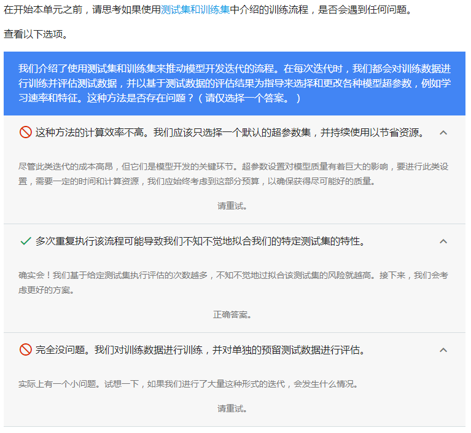
### 标准数据集划分
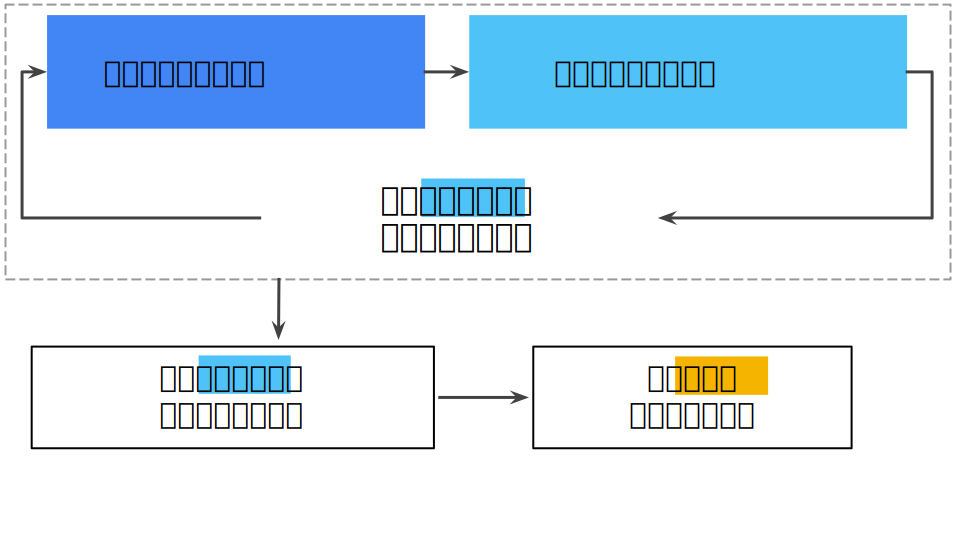
在这个工作流程中：
+ 选择在验证集上获得最佳效果的模型。
+ 使用测试集再次检查该模型。

该工作流程之所以更好，原因在于它暴露给测试集的信息更少。

> 不断使用测试集和验证集会使其逐渐失去效果。也就是说，您使用相同数据来决定超参数设置或其他模型改进的次数越多，您对于这些结果能够真正泛化到未见过的新数据的信心就越低。请注意，验证集的失效速度通常比测试集缓慢。
如果可能的话，建议您收集更多数据来“刷新”测试集和验证集。重新开始是一种很好的重置方式。

### 编程练习
验证编程练习 [validation.ipynb](Google机器学习速成课程Code/validation.ipynb)

## 表示法
学习目标
+ 将日志和 Protocol Buffer 中的字段映射到实用的机器学习特征。
+ 判断哪些特性可用作合适的特征。
+ 处理离群值特征。
+ 调查数据集的统计属性。
+ 使用 tf.estimator 训练并评估模型。
### 特征工程
传统编程的关注点是代码。在机器学习项目中，关注点变成了特征表示。也就是说，开发者通过添加和改善特征来调整模型。
#### 将原始数据映射到特征
图 1 左侧表示来自输入数据源的原始数据，右侧表示特征矢量，也就是组成数据集中样本的浮点值集。 特征工程指的是将原始数据转换为特征矢量。进行特征工程预计需要大量时间。

许多机器学习模型都必须将特征表示为实数向量，因为特征值必须与模型权重相乘。
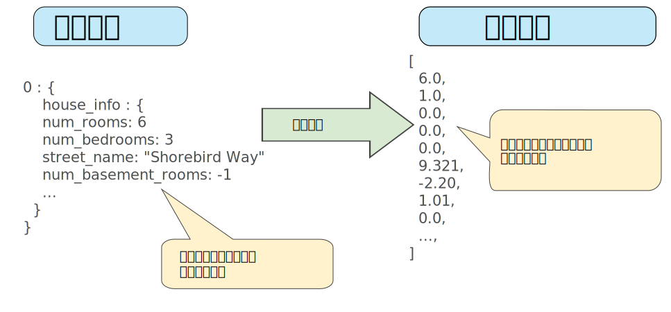
图 1. 特征工程将原始数据映射到机器学习特征。
#### 映射数值
整数和浮点数据不需要特殊编码，因为它们可以与数字权重相乘。如图 2 所示，将原始整数值 6 转换为特征值 6.0 并没有多大的意义：
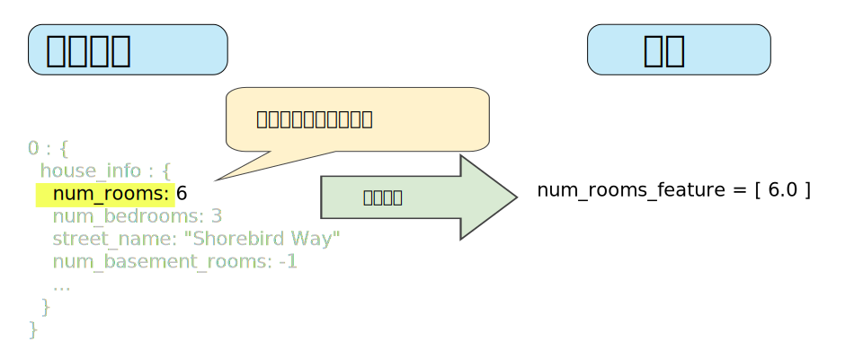
图 2. 将整数值映射到浮点值。
#### 映射分类值
分类特征具有一组离散的可能值。例如，可能有一个名为 street_name 的特征，其中的选项包括：
```
{'Charleston Road', 'North Shoreline Boulevard', 'Shorebird Way', 'Rengstorff Avenue'}
```

由于模型不能将字符串与学习到的权重相乘，因此我们使用特征工程将字符串转换为数字值。要实现这一点，我们可以定义一个从特征值（我们将其称为可能值的词汇表）到整数的映射。世界上的每条街道并非都会出现在我们的数据集中，因此我们可以将所有其他街道分组为一个全部包罗的“其他”类别，称为 OOV（词汇表外）分桶。
通过这种方法，我们可以按照以下方式将街道名称映射到数字：
+ 将 Charleston Road 映射到 0
+ 将 North Shoreline Boulevard 映射到 1
+ 将 Shorebird Way 映射到 2
+ 将 Rengstorff Avenue 映射到 3
+ 将所有其他街道 (OOV) 映射到 4

**不过，如果我们将这些索引数字直接纳入到模型中，将会造成一些可能存在问题的限制**：
+ **我们将学习适用于所有街道的单一权重**。例如，如果我们学习到 street_name 的权重为 6，那么对于 Charleston Road，我们会将其乘以 0，对于 North Shoreline Boulevard 则乘以 1，对于 Shorebird Way 则乘以 2，依此类推。以某个使用 street_name 作为特征来预测房价的模型为例。根据街道名称对房价进行线性调整的可能性不大，此外，这会假设您已根据平均房价对街道排序。我们的模型需要灵活地为每条街道学习不同的权重，这些权重将添加到利用其他特征估算的房价中。
+ **我们没有将 street_name 可能有多个值的情况考虑在内**。例如，许多房屋位于两条街道的拐角处，因此如果模型包含单个索引，则无法在 street_name 值中对该信息进行编码。

**要去除这两个限制，我们可以为模型中的每个分类特征创建一个二元向量来表示这些值，如下所述**：
+ 对于适用于样本的值，将相应向量元素设为 1。
+ 将所有其他元素设为 0。

该向量的长度等于词汇表中的元素数。当只有一个值为 1 时，这种表示法称为**独热编码**；当有多个值为 1 时，这种表示法称为**多热编码**。

图 3 所示为街道 Shorebird Way 的独热编码。在此二元矢量中，代表 Shorebird Way 的元素的值为 1，而代表所有其他街道的元素的值为 0。
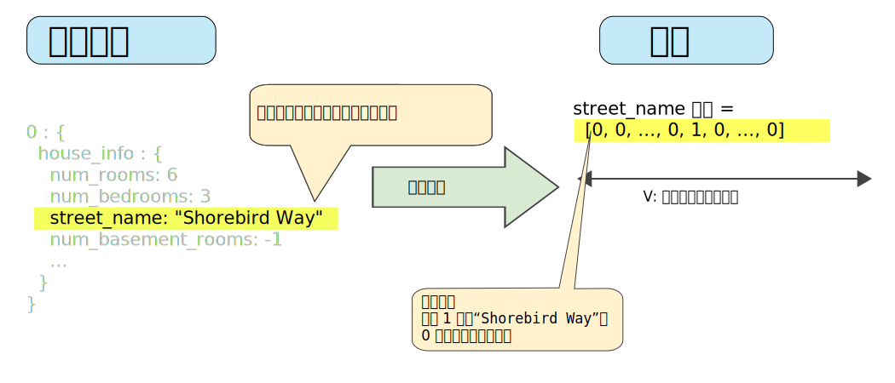
图 3. 通过独热编码映射街道地址。
#### 稀疏表示法
假设数据集中有 100 万个不同的街道名称，您希望将其包含为 street_name 的值。如果直接创建一个包含 100 万个元素的二元向量，其中只有 1 或 2 个元素为 ture，则是一种非常低效的表示法，在处理这些向量时会占用大量的存储空间并耗费很长的计算时间。在这种情况下，一种常用的方法是使用稀疏表示法，其中仅存储非零值。在稀疏表示法中，仍然为每个特征值学习独立的模型权重，如上所述。

### 良好特征的特点
我们探索了将原始数据映射到合适特征矢量的方法，但这只是工作的一部分。现在，我们必须探索什么样的值才算这些特征矢量中良好的特征。

|良好特征的特点|说明|
|-|-|
|避免很少使用的离散特征值|良好的特征值应该在数据集中出现大约 5 次以上。这样一来，模型就可以学习该特征值与标签是如何关联的。也就是说，大量离散值相同的样本可让模型有机会了解不同设置中的特征，从而判断何时可以对标签很好地做出预测。相反，如果某个特征的值仅出现一次或者很少出现，则模型就无法根据该特征进行预测。例如，unique_house_id 就不适合作为特征，因为每个值只使用一次，模型无法从中学习任何规律。|
|最好具有清晰明确的含义|每个特征对于项目中的任何人来说都应该具有清晰明确的含义。例如，下面的房龄适合作为特征，可立即识别是以年为单位的房龄：house_age: 27；相反，对于下方特征值的含义，除了创建它的工程师，其他人恐怕辨识不出：house_age: 851472000；在某些情况下，混乱的数据（而不是糟糕的工程选择）会导致含义不清晰的值。例如，以下 user_age 的来源没有检查值恰当与否：user_age: 277。|
|实际数据内不要掺入特殊值|良好的浮点特征不包含超出范围的异常断点或特殊的值。例如，假设一个特征具有 0 到 1 之间的浮点值。那么，如下值是可以接受的：quality_rating: 0.82；不过，如果用户没有输入 quality_rating，则数据集可能使用如下特殊值来表示不存在该值：quality_rating: -1。**为解决特殊值的问题，需将该特征转换为两个特征**：一个特征只存储质量评分，不含特殊值。一个特征存储布尔值，表示是否提供了 quality_rating。为该布尔值特征指定一个名称，例如 is_quality_rating_defined。|
|考虑上游不稳定性|特征的定义不应随时间发生变化。例如，下列值是有用的，因为城市名称一般不会改变。（注意，我们仍然需要将“br/sao_paulo”这样的字符串转换为独热矢量。）city_id: "br/sao_paulo"；但收集由其他模型推理的值会产生额外成本。可能值“219”目前代表圣保罗，但这种表示在未来运行其他模型时可能轻易发生变化：inferred_city_cluster: "219"。|
### 清理数据
苹果树结出的果子有品相上乘的，也有虫蛀坏果。而高端便利店出售的苹果是 100% 完美的水果。从果园到水果店之间，专门有人花费大量时间将坏苹果剔除或给可以挽救的苹果涂上一层薄薄的蜡。作为一名机器学习工程师，您将花费大量的时间挑出坏样本并加工可以挽救的样本。即使是非常少量的“坏苹果”也会破坏掉一个大规模数据集。
#### 缩放特征值
缩放是指将浮点特征值从自然范围（例如 100 到 900）转换为标准范围（例如 0 到 1 或 -1 到 +1）。如果某个特征集只包含一个特征，则缩放可以提供的实际好处微乎其微或根本没有。不过，如果特征集包含多个特征，则缩放特征可以带来以下优势：
+ 帮助梯度下降法更快速地收敛。
+ 帮助避免“NaN 陷阱”。在这种陷阱中，模型中的一个数值变成 NaN（例如，当某个值在训练期间超出浮点精确率限制时），并且模型中的所有其他数值最终也会因数学运算而变成 NaN。
+ 帮助模型为每个特征确定合适的权重。如果没有进行特征缩放，则模型会对范围较大的特征投入过多精力。

您不需要对每个浮点特征进行完全相同的缩放。即使特征 A 的范围是 -1 到 +1，同时特征 B 的范围是 -3 到 +3，也不会产生什么恶劣的影响。不过，如果特征 B 的范围是 5000 到 100000，您的模型会出现糟糕的响应。
#### 处理极端离群值
下面的曲线图表示的是加利福尼亚州住房数据集中称为 roomsPerPerson 的特征。roomsPerPerson 值的计算方法是相应地区的房间总数除以相应地区的人口总数。该曲线图显示，在加利福尼亚州的绝大部分地区，人均房间数为 1 到 2 间。不过，请看一下 x 轴。
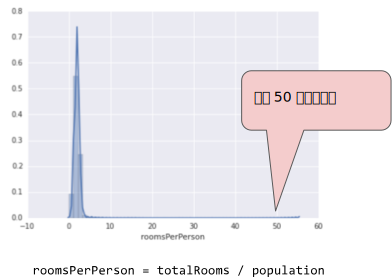
**一个非常非常长的尾巴**。
如何最大限度降低这些极端离群值的影响？一种方法是对每个值取对数：
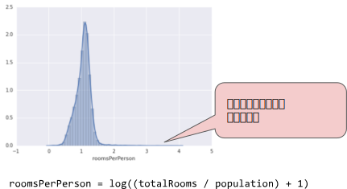
**对数缩放仍然留有尾巴**。
对数缩放可稍稍缓解这种影响，但仍然存在离群值这个大尾巴。我们来采用另一种方法。如果我们只是简单地将 roomsPerPerson 的最大值“限制”为某个任意值（比如 4.0），会发生什么情况呢？
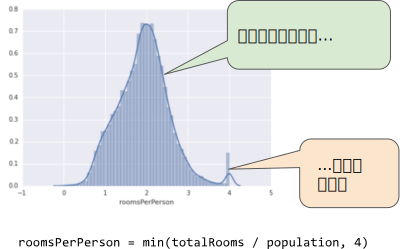
**将特征值限制到 4.0**。
 将特征值限制到 4.0并不意味着我们会忽略所有大于 4.0 的值。而是说，所有大于 4.0 的值都将变成 4.0。这就解释了 4.0 处的那个有趣的小峰值。尽管存在这个小峰值，但是缩放后的特征集现在依然比原始数据有用。
#### 分箱
下面的曲线图显示了加利福尼亚州不同纬度的房屋相对普及率。注意集群 - 洛杉矶大致在纬度 34 处，旧金山大致在纬度 38 处。
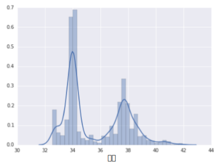
**每个纬度的房屋数**。
在数据集中，latitude 是一个浮点值。不过，在我们的模型中将 latitude 表示为浮点特征没有意义。这是因为纬度和房屋价值之间不存在线性关系。例如，纬度 35 处的房屋并不比纬度 34 处的房屋贵 35/34（或更便宜）。但是，纬度或许能很好地预测房屋价值。
为了将纬度变为一项实用的预测指标，我们对纬度“分箱”，如下图所示：
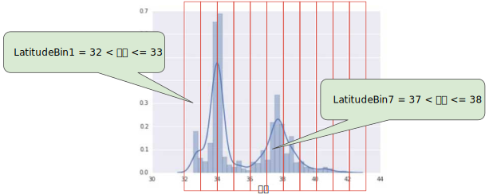
 **分箱值**。
 我们现在拥有 11 个不同的布尔值特征（LatitudeBin1、LatitudeBin2、…、LatitudeBin11），而不是一个浮点特征。拥有 11 个不同的特征有点不方便，因此我们将它们统一成一个 11 元素矢量。这样做之后，我们可以将纬度 37.4 表示为：```[0, 0, 0, 0, 0, 1, 0, 0, 0, 0, 0]```
 分箱之后，我们的模型现在可以为每个纬度学习完全不同的权重。
 > 为了简单起见，我们在纬度样本中使用整数作为分箱边界。如果我们需要更精细的解决方案，我们可以每隔 1/10 个纬度拆分一次分箱边界。添加更多箱可让模型从纬度 37.4 处学习和维度 37.5 处不一样的行为，但前提是每 1/10 个纬度均有充足的样本可供学习。
另一种方法是按分位数分箱，这种方法可以确保每个桶内的样本数量是相等的。按分位数分箱完全无需担心离群值。

#### 清查
截至目前，我们假定用于训练和测试的所有数据都是值得信赖的。在现实生活中，数据集中的很多样本是不可靠的，原因有以下一种或多种：
+ 遗漏值。 例如，有人忘记为某个房屋的年龄输入值。
+ 重复样本。 例如，服务器错误地将同一条记录上传了两次。
+ 不良标签。 例如，有人错误地将一颗橡树的图片标记为枫树。
+ 不良特征值。 例如，有人输入了多余的位数，或者温度计被遗落在太阳底下。

一旦检测到存在这些问题，您通常需要将相应样本从数据集中移除，从而“修正”不良样本。要检测遗漏值或重复样本，您可以编写一个简单的程序。检测不良特征值或标签可能会比较棘手。

除了检测各个不良样本之外，您还必须检测集合中的不良数据。直方图是一种用于可视化集合中数据的很好机制。此外，收集如下统计信息也会有所帮助：
+ 最大值和最小值
+ 均值和中间值
+ 标准偏差

#### 了解数据
遵循以下规则：
+ 记住您预期的数据状态。
+ 确认数据是否满足这些预期（或者您可以解释为何数据不满足预期）。
+ 仔细检查训练数据是否与其他来源（例如信息中心）的数据一致。

像处理任何任务关键型代码一样谨慎处理您的数据。良好的机器学习依赖于良好的数据。
#### 编程练习
特征集编程练习 [feature_sets.ipynb](Google机器学习速成课程Code/feature_sets.ipynb)

## 特征组合
学习目标
+ 了解特征组合。
+ 在 TensorFlow 中实施特征组合。
### 对非线性规律进行编码
我们做出如下假设：
+ 蓝点代表生病的树。
+ 橙点代表健康的树。

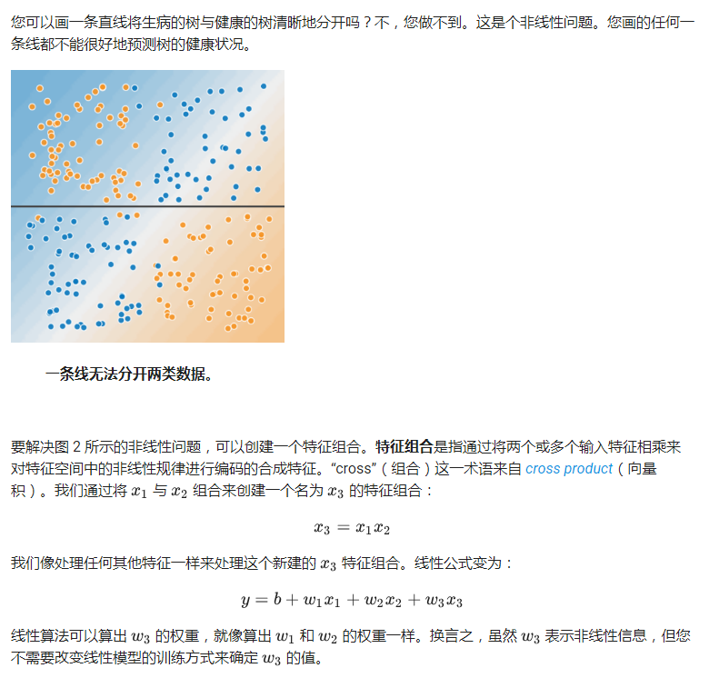

特征组合的种类
我们可以创建很多不同种类的特征组合。例如：
+ [A X B]：将两个特征的值相乘形成的特征组合。
+ [A x B x C x D x E]：将五个特征的值相乘形成的特征组合。
+ [A x A]：对单个特征的值求平方形成的特征组合。

**通过采用随机梯度下降法，可以有效地训练线性模型。因此，在使用扩展的线性模型时辅以特征组合一直都是训练大规模数据集的有效方法。**

### 组合独热矢量
到目前为止，我们已经重点介绍了如何对两个单独的浮点特征进行特征组合。**在实践中，机器学习模型很少会组合连续特征。不过，机器学习模型却经常组合独热特征矢量，将独热特征矢量的特征组合视为逻辑连接**。例如，假设我们具有以下两个特征：国家/地区和语言。对每个特征进行独热编码会生成具有二元特征的矢量，这些二元特征可解读为 country=USA, country=France 或 language=English, language=Spanish。然后，如果您对这些独热编码进行特征组合，则会得到可解读为逻辑连接的二元特征，如下所示：
country:usa AND language:spanish
再举一个例子，假设您对纬度和经度进行分箱，获得单独的独热 5 元素特征矢量。例如，指定的纬度和经度可以表示如下：
binned_latitude = [0, 0, 0, 1, 0]
binned_longitude = [0, 1, 0, 0, 0]
假设您对这两个特征矢量创建了特征组合：
 binned_latitude X binned_longitude
 此特征组合是一个 25 元素独热矢量（24 个 0 和 1 个 1）。该组合中的单个 1 表示纬度与经度的特定连接。然后，您的模型就可以了解到有关这种连接的特定关联性。
 假设我们更粗略地对纬度和经度进行分箱，如下所示：
 ```
 binned_latitude(lat) = [
  0  < lat <= 10
  10 < lat <= 20
  20 < lat <= 30
]

binned_longitude(lon) = [
  0  < lon <= 15
  15 < lon <= 30
]
```

针对这些粗略分箱创建特征组合会生成具有以下含义的合成特征：

```
binned_latitude_X_longitude(lat, lon) = [
  0  < lat <= 10 AND 0  < lon <= 15
  0  < lat <= 10 AND 15 < lon <= 30
  10 < lat <= 20 AND 0  < lon <= 15
  10 < lat <= 20 AND 15 < lon <= 30
  20 < lat <= 30 AND 0  < lon <= 15
  20 < lat <= 30 AND 15 < lon <= 30
]
```
**线性学习器可以很好地扩展到大量数据。对大规模数据集使用特征组合是学习高度复杂模型的一种有效策略。神经网络可提供另一种策略**。
### 编程练习
特征组合编程练习 [feature_crosses.ipynb](Google机器学习速成课程Code/feature_crosses.ipynb)
### 习题
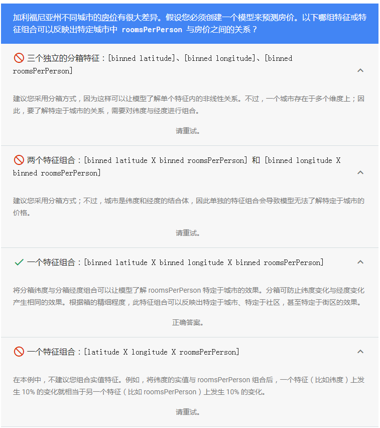

## 正则化：简单性
学习目标
+ 了解复杂度与泛化之间的权衡。
+ 使用 L2 正则化进行实验。
### L2正则化
请查看以下泛化曲线，该曲线显示的是训练集和验证集相对于训练迭代次数的损失。
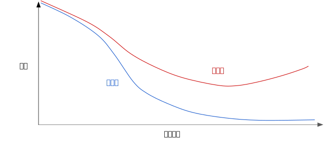
训练集和验证集损失。
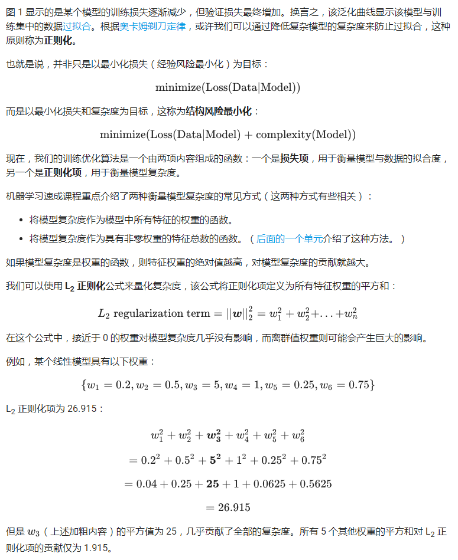
### 正则化参数Lambda
模型开发者通过以下方式来调整正则化项的整体影响：用正则化项的值乘以名为 lambda（又称为正则化率）的标量。也就是说，模型开发者会执行以下运算：
$$minimize(Loss(Data|Model)+\lambda complexity(Model))$$
执行 L2 正则化对模型具有以下影响
+ 使权重值接近于 0（但并非正好为 0）
+ 使权重的平均值接近于 0，且呈正态（钟形曲线或高斯曲线）分布。

增加 lambda 值将增强正则化效果。 例如，lambda 值较高的权重直方图可能会如图 2 所示。
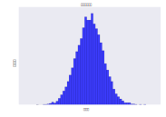
**较高的 lambda 值的权重直方图**
降低 lambda 的值往往会得出比较平缓的直方图，如图 3 所示。
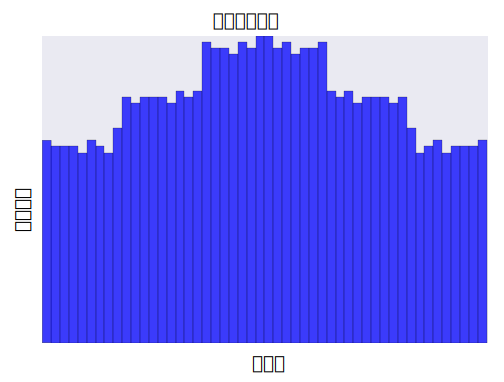
**较低的 lambda 值得出的权重直方图**

在选择 lambda 值时，目标是在简单化和训练数据拟合之间达到适当的平衡：
+ 如果您的 lambda 值过高，则模型会非常简单，但是您将面临数据欠拟合的风险。您的模型将无法从训练数据中获得足够的信息来做出有用的预测。
+ 如果您的 lambda 值过低，则模型会比较复杂，并且您将面临数据过拟合的风险。您的模型将因获得过多训练数据特点方面的信息而无法泛化到新数据。

> 注意：将 lambda 设为 0 可彻底取消正则化。 在这种情况下，训练的唯一目的将是最小化损失，而这样做会使过拟合的风险达到最高。

> 注意：当测试损失明显减少时，训练损失可能会所增加。这属于正常现象，因为您向损失函数添加了另一项来降低复杂度。最终，最重要的是测试损失，因为它是真正用于衡量模型能否针对新数据做出良好预测的标准。

理想的 lambda 值生成的模型可以很好地泛化到以前未见过的新数据。 遗憾的是，理想的 lambda 值取决于数据，因此您需要手动或自动进行一些调整。

#### 学习速率和 lambda 之间存在密切关联
学习速率和 lambda 之间存在密切关联。强 L2 正则化值往往会使特征权重更接近于 0。较低的学习速率（使用早停法）通常会产生相同的效果，因为与 0 的距离并不是很远。 因此，同时调整学习速率和 lambda 可能会产生令人混淆的效果。

早停法指的是在模块完全收敛之前就结束训练。在实际操作中，我们经常在以在线（连续）方式进行训练时采取一些隐式早停法。也就是说，一些新趋势的数据尚不足以收敛。

如上所述，更改正则化参数产生的效果可能会与更改学习速率或迭代次数产生的效果相混淆。一种有用的做法（在训练一批固定的数据时）是执行足够多次迭代，这样早停法便不会起作用。
### 习题


## 逻辑回归
学习目标
+ 了解逻辑回归。
+ 了解逻辑回归的损失和正则化函数。
### 计算概率
许多问题需要将概率估算值作为输出。逻辑回归是一种极其高效的概率计算机制。实际上，您可以通过下两种方式之一使用返回的概率：
+ “按原样”
+ 转换成二元类别。

我们来了解一下如何“按原样”使用概率。假设我们创建一个逻辑回归模型来预测狗在半夜发出叫声的概率。我们将此概率称为：p(bark | night)
如果逻辑回归模型预测 p(bark | night) 的值为 0.05，那么一年内，狗的主人应该被惊醒约 18 次：startled = p(bark | night) * nights, 18 ~= 0.05 * 365

在很多情况下，您会将逻辑回归输出映射到二元分类问题的解决方案，该二元分类问题的目标是正确预测两个可能的标签（例如，“垃圾邮件”或“非垃圾邮件”）中的一个。

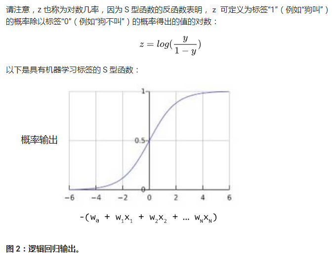
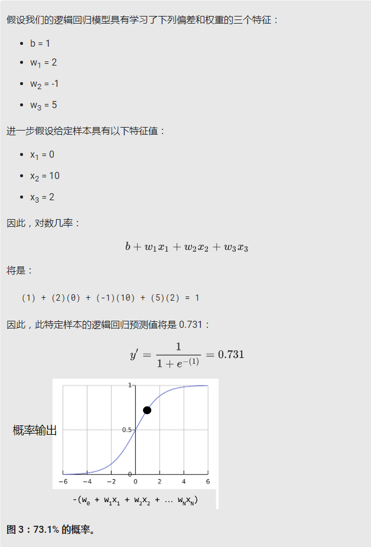

## 分类
学习目标
+ 评估逻辑回归模型的准确率和精确率。
+ 了解 ROC 曲线和曲线下面积。
### 阈值
逻辑回归返回的是概率。您可以“原样”使用返回的概率（例如，用户点击此广告的概率为 0.00023），也可以将返回的概率转换成二元值（例如，这封电子邮件是垃圾邮件）。

如果某个逻辑回归模型对某封电子邮件进行预测时返回的概率为 0.9995，则表示该模型预测这封邮件非常可能是垃圾邮件。相反，在同一个逻辑回归模型中预测分数为 0.0003 的另一封电子邮件很可能不是垃圾邮件。可如果某封电子邮件的预测分数为 0.6 呢？为了将逻辑回归值映射到二元类别，您必须指定分类阈值（也称为判定阈值）。如果值高于该阈值，则表示“垃圾邮件”；如果值低于该阈值，则表示“非垃圾邮件”。**人们往往会认为分类阈值应始终为 0.5，但阈值取决于具体问题，因此您必须对其进行调整**。

我们将在后面的部分中详细介绍可用于对分类模型的预测进行评估的指标，以及更改分类阈值对这些预测的影响。

> 注意：“调整”逻辑回归的阈值不同于调整学习速率等超参数。在选择阈值时，需要评估您将因犯错而承担多大的后果。例如，将非垃圾邮件误标记为垃圾邮件会非常糟糕。不过，虽然将垃圾邮件误标记为非垃圾邮件会令人不快，但应该不会让您丢掉工作。

### 阳性与阴性；正分类与负分类
在本部分，我们将定义用于评估分类模型的指标的主要组成部分。不过，我们先来看一则寓言故事：
**伊索寓言：狼来了（精简版）**
有一位牧童要照看镇上的羊群，但是他开始厌烦这份工作。为了找点乐子，他大喊道：“狼来了！”其实根本一头狼也没有出现。村民们迅速跑来保护羊群，但他们发现这个牧童是在开玩笑后非常生气。
这样的情形重复出现了很多次。
一天晚上，牧童看到真的有一头狼靠近羊群，他大声喊道：“狼来了！”村民们不想再被他捉弄，都待在家里不出来。这头饥饿的狼对羊群大开杀戒，美美饱餐了一顿。这下子，整个镇子都揭不开锅了。恐慌也随之而来。

我们做出以下定义：
+ “狼来了”是正类别。
+ “没有狼”是负类别。

我们可以使用一个 2x2 混淆矩阵来总结我们的“狼预测”模型，该矩阵描述了所有可能出现的结果（共四种）：
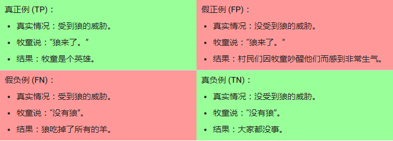
真正例是指模型将正类别样本正确地预测为正类别。同样，真负例是指模型将负类别样本正确地预测为负类别。
假正例是指模型将负类别样本错误地预测为正类别，而假负例是指模型将正类别样本错误地预测为负类别。
> 简单记忆理解：正与负对应模型判断，真与假是对应模型判断的正误。举例：负例对应没有狼，假负例表示负例判断错误，真实情况是有狼。

### 准确率
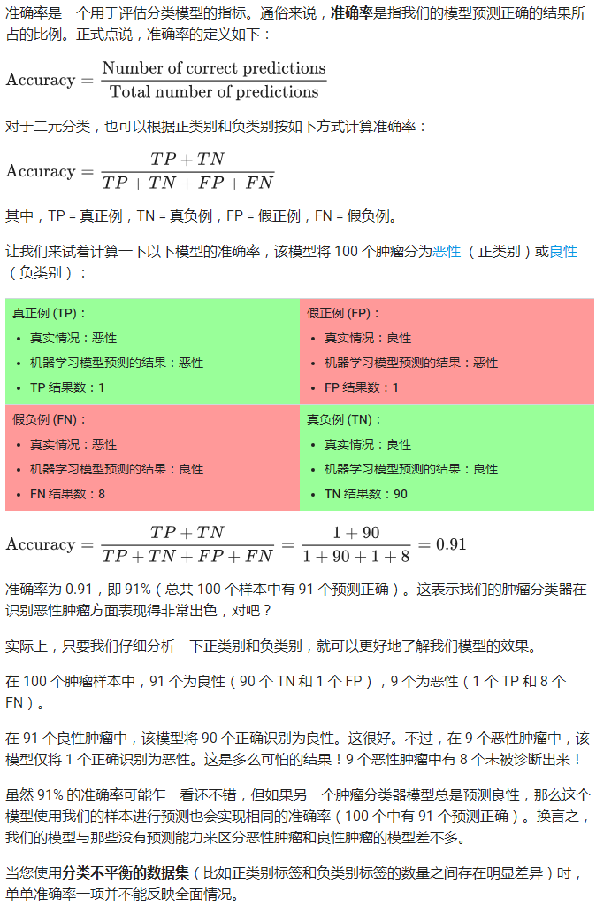
### 精确率和召回率
#### 精确率

#### 召回率
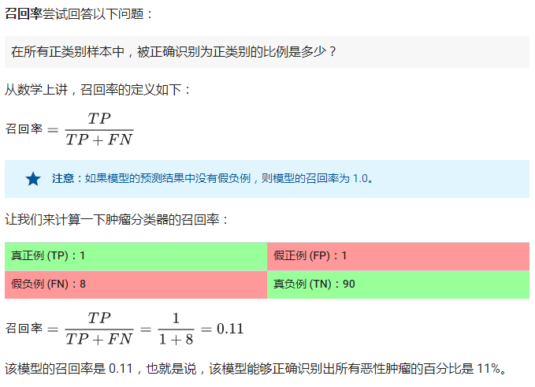
#### 精确率和召回率的关系
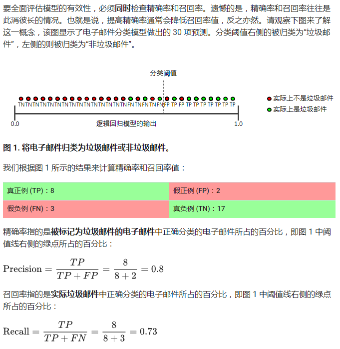

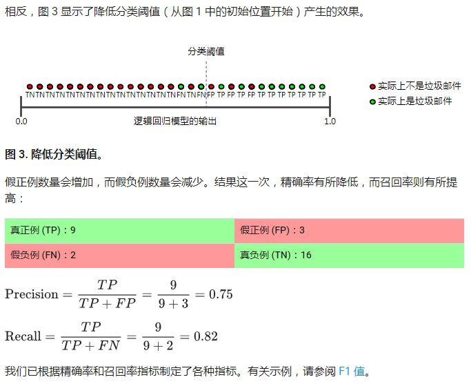
### ROC和曲线下面积
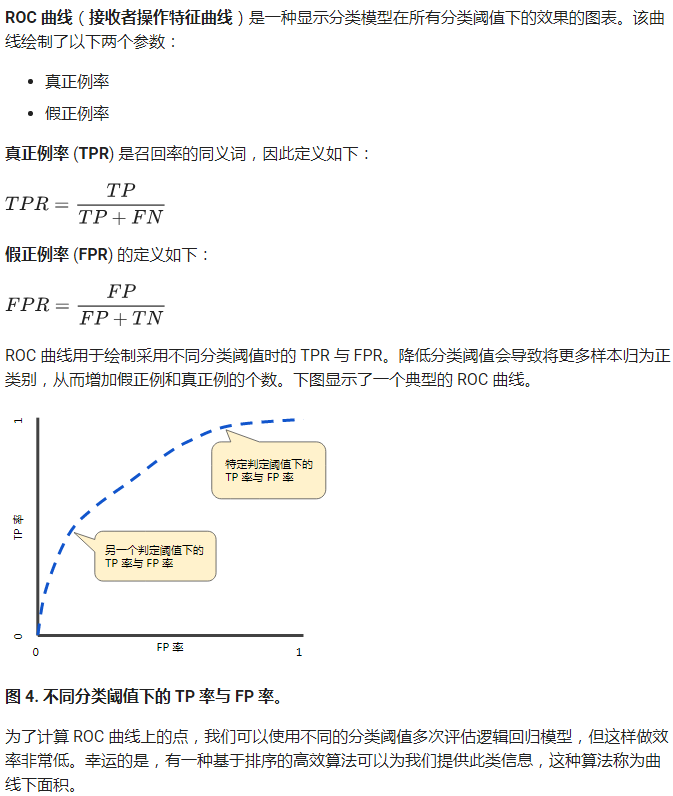
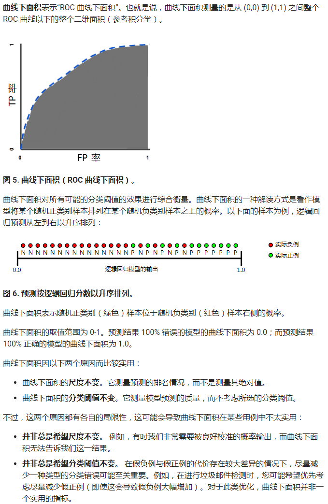
### 预测偏差

#### 分桶偏差和预测偏差
逻辑回归可预测 0 到 1 之间的值。不过，所有带标签样本都正好是 0（例如，0 表示“非垃圾邮件”）或 1（例如，1 表示“垃圾邮件”）。因此，在检查预测偏差时，您无法仅根据一个样本准确地确定预测偏差；您必须在“一大桶”样本中检查预测偏差。也就是说，只有将足够的样本组合在一起以便能够比较预测值（例如 0.392）与观察值（例如 0.394），逻辑回归的预测偏差才有意义。

您可以通过以下方式构建桶：
+ 以线性方式分解目标预测。
+ 构建分位数。

请查看以下某个特定模型的校准曲线。每个点表示包含 1000 个值的分桶。两个轴具有以下含义：
+ x 轴表示模型针对该桶预测的平均值。
+ y 轴表示该桶的数据集中的实际平均值。

两个轴均采用对数尺度。
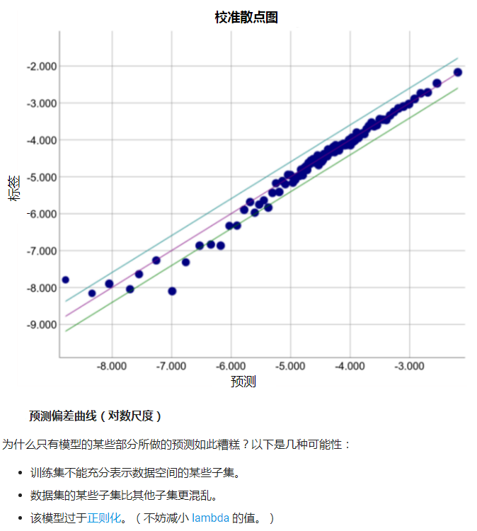
### 习题


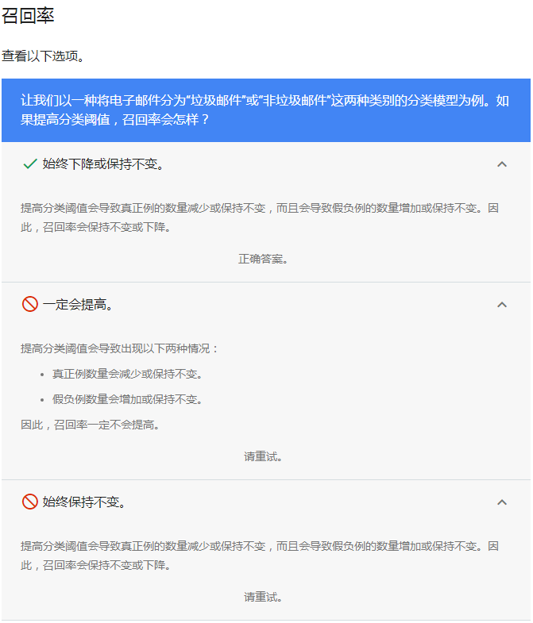


### 编程练习
逻辑回归编程练习 [logistic_regression.ipynb](Google机器学习速成课程Code/logistic_regression.ipynb)


## 神经网络简介
对神经网络有一定的了解，尤其是了解以下方面：
+ 隐藏层
+ 激活函数
### 神经网络剖析
#### 隐藏层
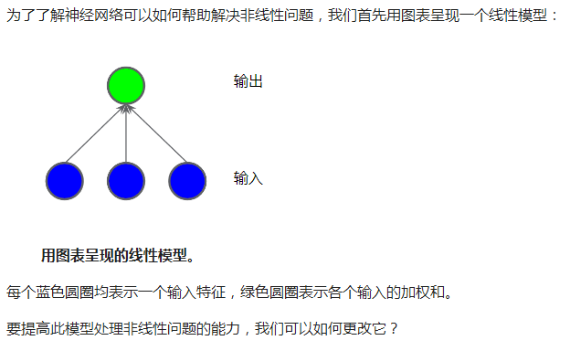
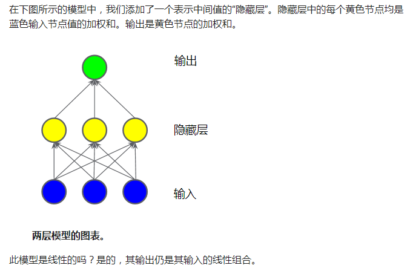
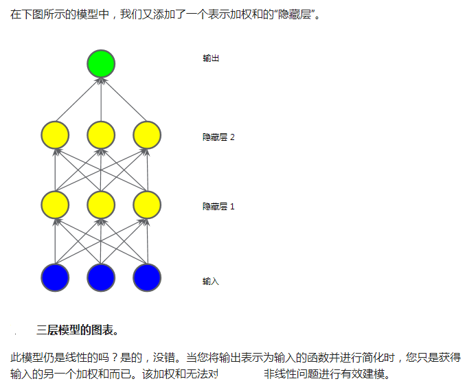
#### 激活函数
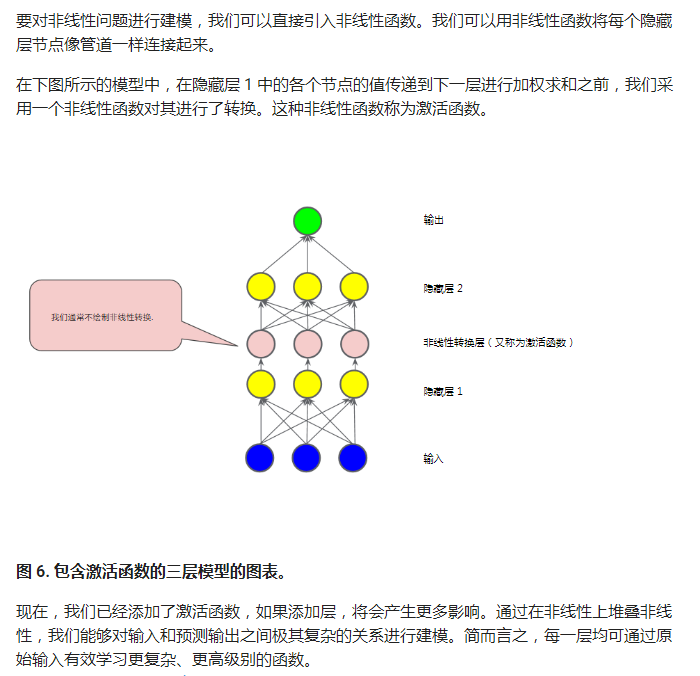
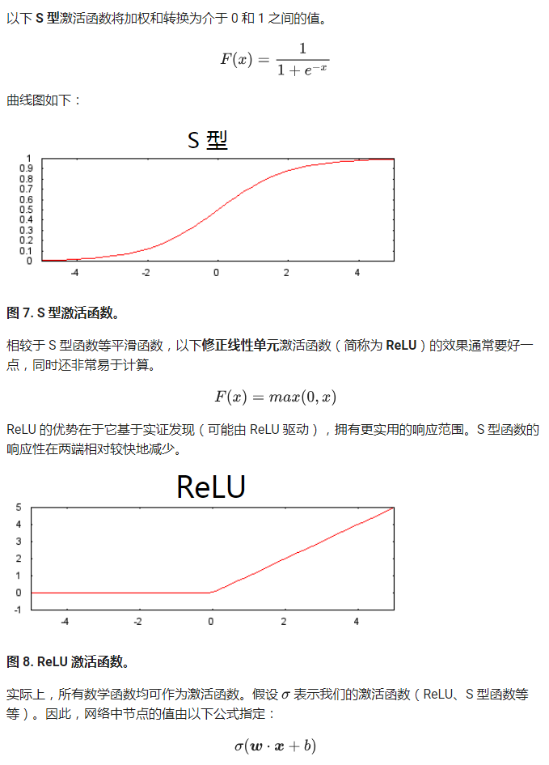

现在，我们的模型拥有了人们通常所说的“神经网络”的所有标准组件：
1. 一组节点，类似于神经元，位于层中。
2. 一组权重，表示每个神经网络层与其下方的层之间的关系。下方的层可能是另一个神经网络层，也可能是其他类型的层。
3. 一组偏差，每层节点一个偏差。
4. 一个激活函数，对层中每个节点的输出进行转换。不同的层可能拥有不同的激活函数。

> 警告：神经网络不一定始终比特征组合好，但它确实可以提供适用于很多情形的灵活替代方案。

### 编程练习
神经网络简介编程练习 [intro_to_neural_nets.ipynb](Google机器学习速成课程Code/intro_to_neural_nets.ipynb)


## 训练神经网络
学习目标
+ 在一定程度上了解反向传播算法。
### 最佳做法
本部分介绍了反向传播算法的失败案例，以及正则化神经网络的常见方法。
#### 失败案例
很多常见情况都会导致反向传播算法出错。

|反向传播算法出错原因|解决办法|
|-|-|
|梯度消失|较低层（更接近输入）的梯度可能会变得非常小。在深度网络中，计算这些梯度时，可能涉及许多小项的乘积。当较低层的梯度逐渐消失到 0 时，这些层的训练速度会非常缓慢，甚至不再训练。ReLU 激活函数有助于防止梯度消失。|
|梯度爆炸|如果网络中的权重过大，则较低层的梯度会涉及许多大项的乘积。在这种情况下，梯度就会爆炸：梯度过大导致难以收敛。批标准化可以降低学习速率，因而有助于防止梯度爆炸。|
|ReLU 单元消失|一旦 ReLU 单元的加权和低于 0，ReLU 单元就可能会停滞。它会输出对网络输出没有任何贡献的 0 激活，而梯度在反向传播算法期间将无法再从中流过。由于梯度的来源被切断，ReLU 的输入可能无法作出足够的改变来使加权和恢复到 0 以上。降低学习速率有助于防止 ReLU 单元消失。|

#### 丢弃正则化
这是称为丢弃的另一种形式的正则化，可用于神经网络。其工作原理是，在梯度下降法的每一步中随机丢弃一些网络单元。丢弃得越多，正则化效果就越强：
+ 0.0 = 无丢弃正则化。
+ 1.0 = 丢弃所有内容。模型学不到任何规律。
+ 0.0 和 1.0 之间的值更有用。

### 编程练习
提高神经网络的性能编程练习 [improving_neural_net_performance.ipynb](Google机器学习速成课程Code/improving_neural_net_performance.ipynb)

## 多类别分类神经网络
学习目标
+ 理解多类别分类问题，尤其是 Softmax。
+ 在 TensorFlow 中制定 Softmax 解决方案。

前面您已经了解了二元分类模型，该模型可从两个可能的选项中选择其一，例如：
+ 特定电子邮件是垃圾邮件还是非垃圾邮件。
+ 特定肿瘤是恶性肿瘤还是良性肿瘤。

在本单元中，我们将研究多类别分类，这种模型可从多种可能的情况中进行选择。例如：
+ 这条狗是小猎犬、巴吉度猎犬还是寻血猎犬？
+ 这朵花是西伯利亚鸢尾花、荷兰鸢尾花、蓝旗鸢尾花还是有髯鸢尾花？
+ 那架飞机是波音 747、空中客车 320、波音 777 还是 Embraer 190？
+ 这是一张苹果、熊、糖果、狗狗还是鸡蛋的图片？

现实世界中的一些多类别问题需要从数百万个类别中进行选择。例如，一个几乎能够识别任何事物图片的多类别分类模型。
### 一对多
一对多提供了一种利用二元分类的方法。鉴于一个分类问题会有 N 个可行的解决方案，一对多解决方案包括 N 个单独的二元分类器，每个可能的结果对应一个二元分类器。在训练期间，模型会训练一系列二元分类器，使每个分类器都能回答单独的分类问题。以一张狗狗的照片为例，可能需要训练五个不同的识别器，其中四个将图片看作负样本（不是狗狗），一个将图片看作正样本（是狗狗）。即：
1. 这是一张苹果的图片吗？不是。
2. 这是一张熊的图片吗？不是。
3. 这是一张糖果的图片吗？不是。
4. 这是一张狗狗的图片吗？是。
5. 这是一张鸡蛋的图片吗？不是。

当类别总数较少时，这种方法比较合理，但随着类别数量的增加，其效率会变得越来越低下。

我们可以借助深度神经网络（在该网络中，每个输出节点表示一个不同的类别）创建明显更加高效的一对多模型。下图展示了这种方法：
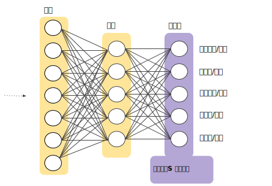
### Softmax
我们已经知道，逻辑回归可生成介于 0 和 1.0 之间的小数。例如，某电子邮件分类器的逻辑回归输出值为 0.8，表明电子邮件是垃圾邮件的概率为 80%，不是垃圾邮件的概率为 20%。很明显，一封电子邮件是垃圾邮件或非垃圾邮件的概率之和为 1.0。


Softmax 将这一想法延伸到多类别领域。也就是说，在多类别问题中，Softmax 会为每个类别分配一个用小数表示的概率。这些用小数表示的概率相加之和必须是 1.0。**与其他方式相比，这种附加限制有助于让训练过程更快速地收敛**。

Softmax 层是紧挨着输出层之前的神经网络层。Softmax 层必须和输出层拥有一样的节点数。
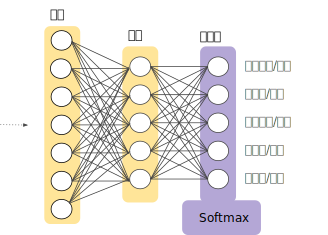

### Softmax选项
请查看以下 Softmax 变体：
+ 完整 Softmax 是我们一直以来讨论的 Softmax；也就是说，Softmax 针对每个可能的类别计算概率。
+ 候选采样指 Softmax 针对所有正类别标签计算概率，但仅针对负类别标签的随机样本计算概率。例如，如果我们想要确定某个输入图片是小猎犬还是寻血猎犬图片，则不必针对每个非狗狗样本提供概率。

类别数量较少时，完整 Softmax 代价很小，但随着类别数量的增加，它的代价会变得极其高昂。候选采样可以提高处理具有大量类别的问题的效率。

### 一个标签与多个标签
Softmax 假设每个样本只是一个类别的成员。但是，一些样本可以同时是多个类别的成员。对于此类示例：
+ 您不能使用 Softmax。
+ 您必须依赖多个逻辑回归。

例如，假设您的样本是只包含一项内容（一块水果）的图片。Softmax 可以确定该内容是梨、橙子、苹果等的概率。如果您的样本是包含各种各样内容（几碗不同种类的水果）的图片，您必须改用多个逻辑回归。
### 编程练习
MNIST 数字分类编程练习 [multi_class_classification_of_handwritten_digits.ipynb](Google机器学习速成课程Code/multi_class_classification_of_handwritten_digits.ipynb)

## 嵌入
学习目标
+ 学习嵌套的定义和用途。
+ 学习嵌套如何编码语义关系。
+ 学习如何使用嵌套。
+ 学习如何训练有意义的嵌套（例如使用 word2vec）。

嵌入是一种相对低维的空间，您可以将高维矢量映射到这种低维空间里。通过使用嵌套，可以让在大型输入（比如代表字词的稀疏矢量）上进行机器学习变得更加容易。在理想情况下，嵌套可以将语义上相似的不同输入映射到嵌套空间里的邻近处，以此来捕获输入的语义。一个模型学习到的嵌套，也可以被其他模型重用。
### 协同过滤的目的
协同过滤是一项可以预测用户兴趣（根据很多其他用户的兴趣）的任务。以影片推荐的任务为例，假设我们有 100 万个用户，以及每位用户观看过的影片的列表（可供观看的影片共有 50 万部）。 我们的目标是向用户推荐影片。

要解决这个问题，我们需要使用某种方法来确定哪些影片是相似的。我们可以通过将影片嵌套到低维空间（使得相似的影片彼此邻近）来实现这个目标。

在介绍如何学习嵌套之前，我们先来了解一下我们希望嵌套具备的特质类型，以及我们将如何表示训练数据以供学习嵌套。
#### 在一维数轴上排列影片

#### 在二维空间中排列影片
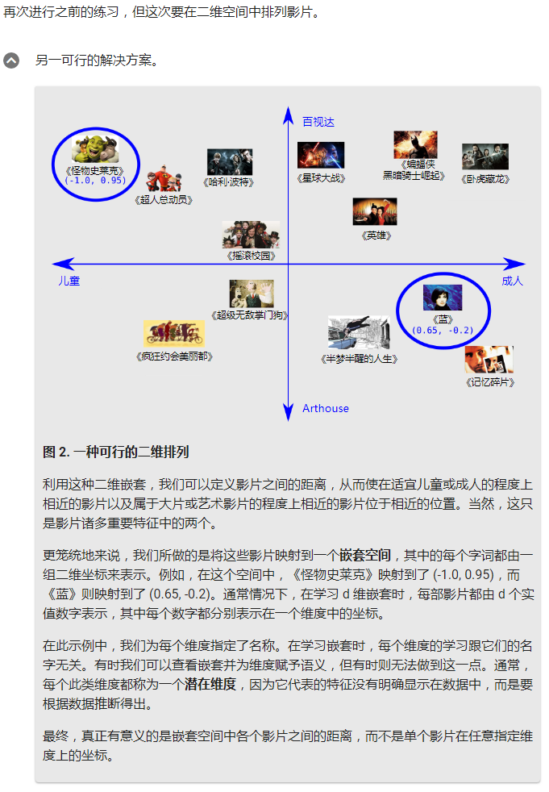
### 分类输入数据
分类数据是指用于表示一组有限选项中的一个或多个离散项的输入特征。例如，它可以是某用户观看过的一组影片，某文档中使用的一系列单词，或某人从事的职业。

分类数据的最高效表示方式是使用稀疏张量（一种含有极少非零元素的张量）。例如，如果要构建一个影片推荐模型，可以为每部可能的影片分别分配一个唯一的 ID，然后通过用户已观看影片的稀疏张量来表示每位用户，如图 3 所示。
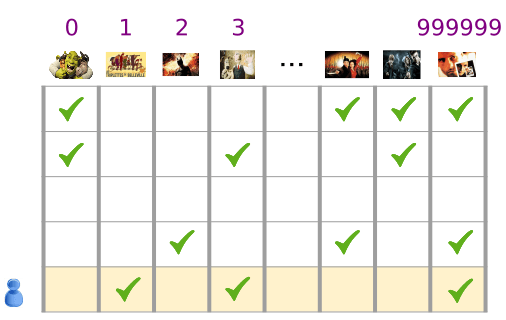
**图 3. 影片推荐问题的数据**。
在图 3 的矩阵中，每一行都是一个显示用户的影片观看记录的样本，并以稀疏张量的形式表示，因为每个用户只会观看所有可能的影片中的一小部分。根据影片图标上方所示的索引，最后一行对应于稀疏张量 [1, 3, 999999]。

类似地，我们还可将字词、句子和文档表示为稀疏矢量 - 在这种情况下，词汇表内每个字词所扮演的角色类似于推荐示例中的影片。

**为了能够在机器学习系统中使用这类表示法，我们需要将每个稀疏矢量表示为数字矢量，从而使语义上相似的项（影片或字词）在矢量空间中具有相似的距离**。但如何将字词表示为数字矢量呢？

最简单的方法是：定义一个巨型输入层，并在其中为词汇表内的每个字词设定一个节点，或者至少为您数据中出现的每个字词设定一个节点。如果您的数据中出现了 50 万个独一无二的单词，您可以使用长度为 50 万的矢量来表示每个单词，并将每个字词分配到相应矢量中对应的索引位置。

如果为“马”分配的索引是 1247，那么为了将“马”馈入到您的网络中，可以将第 1247 个输入节点设成 1，其余节点设成 0。这种表示法称为独热编码 (one-hot encoding)，因为只有一个索引具有非零值。

更常见的是，使用一个包含各个单词在大块文本中出现次数的向量。这被称为“词袋”(bag of words) 表示法。在一个词袋矢量中，50 万个节点中的若干个节点将会具有非零值。

不过，无论您如何确定非零值，若将节点与字词一一对应，您得到的输入矢量就会比较稀疏 - 即：矢量很大，但非零值相对较少。**稀疏表示法存在多项问题（如下所述，网络的规模和矢量之间缺乏有意义的联系）**，这些问题可能会致使模型很难高效地学习。

#### 网络的规模
巨型输入矢量意味着神经网络的对应权重数目会极其庞大。如果您的词汇表内有 M 个字词，而神经网络输入层上方的第一层内有 N 个节点，您便需要为该层训练 MxN 个权重。权重数目过大会进一步引发以下问题：
+ 数据量：模型中的权重越多，高效训练所需的数据就越多。
+ 计算量：权重越多，训练和使用模型所需的计算就越多。这很容易就会超出您硬件的能力范围。

#### 矢量之间缺乏有意义的联系
如果您已将 RGB 通道的像素值馈入到图片分类器中，分析“邻近”值便行得通。不管是从语义上来看，还是从矢量之间的几何距离来看，红蓝色与纯蓝色都是邻近的。不过，对于在索引 1247 处设为 1 以表示“马”的矢量而言，如果说它与在索引 238 处设为 1 以表示“电视机”的矢量不够邻近，那么它与在索引 50430 处设为 1 以表示“羚羊”的矢量亦然。

#### 解决方案：嵌套（嵌入）
上述问题的解决方案就是使用嵌套，也就是将大型稀疏矢量映射到一个保留语义关系的低维空间。在此模块的随后几个部分中，我们将从直观角度、概念角度和编程角度来详细探讨嵌套。

### 转换到低纬度空间
要解决稀疏输入数据的核心问题，您可以将高维度数据映射到低维度空间。

通过纸上练习您已了解，即便是小型多维空间，也能自由地将语义上相似的项归到一起，并将相异项分开。矢量空间中的位置（距离和方向）可对良好的嵌套中的语义进行编码。例如，下面的真实嵌套可视化图所展示的几何关系图捕获了国家与其首都之间的语义关系。

**嵌套可产生精彩的模拟**。
借助这种有意义的空间，机器学习系统能够检测出对学习任务可能有帮助的模式。
#### 收缩网络
尽管我们需要足够的维度来编码丰富的语义关系，但我们也需要足够小的嵌套空间来更快速地训练我们的系统。实用嵌套的量级大致有数百个维度。这可能比您在自然语言任务中使用的词汇规模要小好几个数量级。
#### 嵌套充当查询表
嵌套是一个矩阵，每列表示您词汇中的一项所对应的矢量。要获得某个词汇项的密集矢量，您可以检索该项所对应的列。

但是，如何转换字词矢量的稀疏包呢？要获得表示多个词汇项（例如，一句或一段中的所有字词）的稀疏矢量的密集矢量，您可以检索各项的嵌套，然后将它们相加。

如果稀疏矢量包含词汇项的计数，则您可以将每项嵌套与其对应项的计数相乘，然后再求和。

这些运算可能看起来很眼熟吧。

嵌套查询充当矩阵乘法
我们刚刚阐述的查询、乘法和加法程序等效于矩阵乘法。假设有一个 1 X N 的稀疏表示 S 和一个 N X M 的嵌套表 E，矩阵乘法 S X E 可以得出密集矢量 1 X M。

但首要问题是，如何获取 E 呢？我们将在下一部分介绍如何获取嵌套。

### 获取嵌入（嵌套）
您可以通过多种方式来获取嵌套，包括 Google 研发的世界一流算法。
#### 标准降维技术
目前有很多在低维空间捕获高维空间重要结构的数学技术。理论上，这些技术都可以用来创建用于机器学习系统的嵌套。

例如，主成分分析 (PCA) 已用于创建字词嵌套。在给定一组实例的情况下，例如字词矢量包，PCA 会尝试查找高度相关且可以合并的维度。
#### Word2vec
Word2vec 是 Google 为了训练字词嵌套而研发的一种算法。Word2vec 基于分布假设，将语义上相似的字词映射到在几何图形上邻近的嵌套矢量。

分布假设指出经常具有相同相邻字词的字词往往在语义上相似。“狗”和“猫”这两个字词经常靠近“兽医”一词出现，这就可以说明这两个字词在语义上相似。正如语言学家约翰·弗斯 (John Firth) 在 1957 年所言：“观其伴而知其意”。

Word2Vec 通过训练神经网络来区分实际共同出现的多组字词与随机出现在一起的字词，从而充分利用此类上下文信息。输入层采用一种稀疏表示法用于组合一个目标字词与一个或多个上下文字词。这一输入层会连接到一个较小的隐藏层。

在其中一版算法中，系统通过用随机噪点字词替代目标字词来举出反面示例。在给出正面示例“the plane flies”的情况下，系统可能会换成“jogging”来创建对比鲜明的反面示例“the jogging flies”。

另一版算法通过将真实的目标字词与随机选择的上下文字词配对来创建反面示例。因此，系统可能会举出正面示例（(the, plane)、(flies, plane)）和反面示例（(compiled, plane)、(who, plane)），然后通过学习分辨哪几对真正地在文字中一起出现。

不过，分类器不是上述任何一版算法的真正用途。在训练模型后，你得到的是一组嵌套。借助将输入层连接到隐藏层的权重，您可以将字词的稀疏表示映射到小型矢量。这类嵌套可在其他分类器中重复利用。

要详细了解 word2vec，请参阅 tensorflow.org 上的教程
#### 将嵌套训练为大型模型的一部分
您也可以将嵌套作为目标任务的神经网络的一部分进行学习。通过这个方法，您可以为自己的特定系统量身定制嵌套，不过耗费的时间可能要比单独训练嵌套的时间长。

一般来说，当您具有稀疏数据（或您想要嵌套的密集数据）时，您可以创建一个嵌套单元，这个嵌套单元其实是大小为 d 的一个特殊类型的隐藏单元。此嵌套层可与任何其他特征和隐藏层组合。和任何 DNN 中一样，最终层将是要进行优化的损失函数。例如，假设我们正在执行协同过滤，目标是根据其他用户的兴趣预测某位用户的兴趣。我们可以将这个问题作为监督式学习问题进行建模，具体做法是随机选取（或留出）用户观看过的一小部分影片作为正类别标签，然后再优化 Softmax 损失。
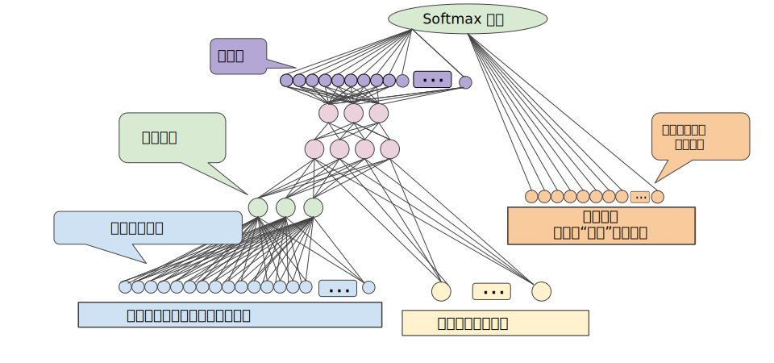
**图 5. 根据协同过滤数据学习影片嵌套的 DNN 架构示例**。
再举一个例子，如果您想在 DNN 中针对房地产广告词创建嵌套层来预测房价，则您可以将训练数据中的已知房屋售价用作标签来优化 L2 损失。

在学习 d 维嵌套时，每一项都会映射到 d 维空间中的一个点，这样相似项就会在该空间内彼此邻近。图 6 说明了在嵌套层中学到的权重与几何视图之间的关系。输入节点与 d 维嵌套层中的节点之间的边的权重对应于 d 维坐标轴中每一维的坐标值。

**图 6. 嵌套层权重的几何视图**。
### 编程练习
嵌套编程练习 [intro_to_sparse_data_and_embeddings.ipynb](Google机器学习速成课程Code/intro_to_sparse_data_and_embeddings.ipynb)

# 机器学习工程
学习目标
+ 了解生产环境机器学习系统中组件的跨度范围。

到目前为止，机器学习速成课程重点介绍了如何构建机器学习模型。不过，如下图所示，现实世界中采用的生产机器学习系统是大型生态系统，模型只是其中的一部分。
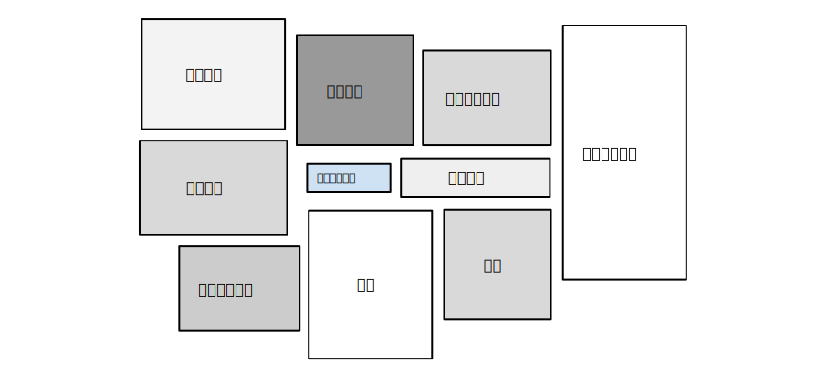
**应用于现实世界的生产环境机器学习系统**。

机器学习代码是现实世界生产环境机器学习系统的核心，但它通常最多只占整个生产环境机器学习系统整体代码的 5%。请注意，生产环境机器学习系统会将大量资源投入到输入数据中 - 收集输入数据、对其进行验证以及从中提取特征。另请注意，服务基础架构必须到位，以便机器学习模型的预测能投入到现实世界的实际运用中。

幸运的是，上图中的许多组件可以重复使用，而且，您无需自行构建图中的所有组件。TensorFlow 可提供其中许多组件，而其他选项可通过 Spark 或 Hadoop 等其他平台获取。后续单元会指导您如何在构建生产环境机器学习系统时做出设计决策。

## 静态训练与动态训练
学习目标
+ 识别静态训练与动态训练的优缺点。

从广义上讲，训练模型的方式有两种：
+ 静态模型采用离线训练方式。也就是说，我们只训练模型一次，然后使用训练后的模型一段时间。
+ 动态模型采用在线训练方式。也就是说，数据会不断进入系统，我们通过不断地更新系统将这些数据整合到模型中。

从广义上讲，静态训练和动态训练的选择由以下几点决定：
+ 静态模型更易于构建和测试。
+ 动态模型可以适应不断变化的数据。世界瞬息万变。基于去年的数据作出的销售预测很可能无法成功预测下一年的情况。

如果您的数据集确实不会随时间而变化，则选择静态训练，因为其创建和维护成本低于动态训练。不过，事实上，很多信息源都会随时间而变化（甚至是某些您认为恒久不变的特征，例如海平面）。结论：即便是静态训练，也必须监控输入数据是否发生变化。

例如，假设我们训练一个模型来预测用户买花的概率。由于时间压力，我们仅使用七月和八月期间的一个买花行为数据集对模型进行了训练。然后，就将模型应用到生产中来提供预测，但从未更新过它。 模型正常工作了几个月，但在情人节前后的预测表现非常糟糕，这是因为用户行为在这一节日期间发生了巨大变化。
### 习题
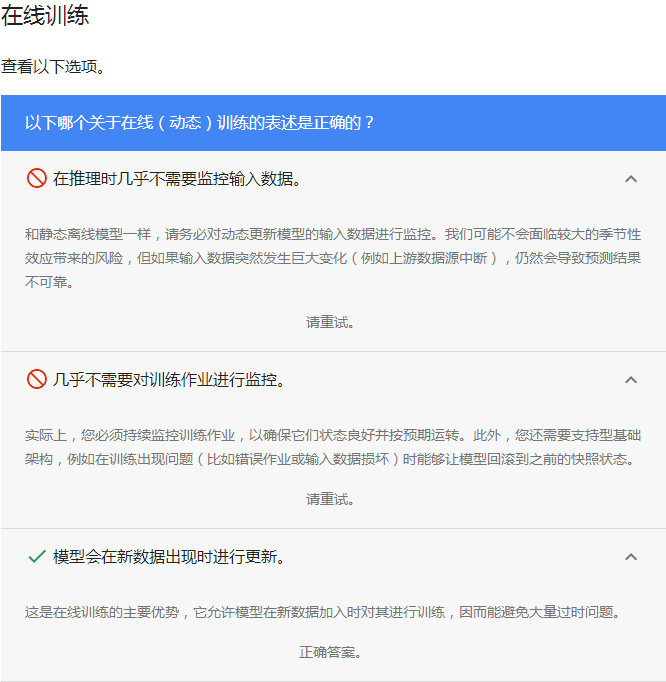
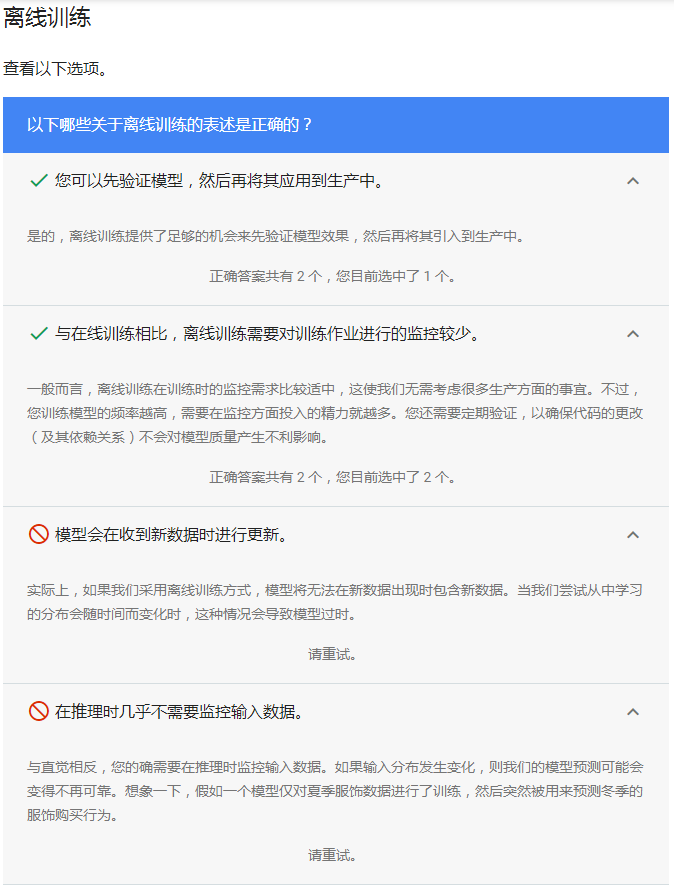

## 静态推理与动态推理
学习目标
+ 了解静态推理和动态推理的优缺点。
+ 评估现实世界情形的训练和应用需求。

您可以选择以下任一推理策略：
+ 离线推理，指的是使用 MapReduce 或类似方法批量进行所有可能的预测。然后，将预测记录到 SSTable 或 Bigtable 中，并将它们提供给一个缓存/查询表。
+ 在线推理，指的是使用服务器根据需要进行预测。

以下是离线推理的优缺点：
+ 优点：不需要过多担心推理成本。
+ 优点：可以使用批量方法或某些巨型 MapReduce 方法。
+ 优点：可以在推送之前对预测执行后期验证。
+ 缺点：只能对我们知晓的数据进行预测，不适用于存在长尾的情况。
+ 缺点：更新可能延迟数小时或数天。

以下是在线推理的优缺点：
+ 优点：可在新项目加入时对其进行预测，非常适合存在长尾的情况。
+ 缺点：计算量非常大，对延迟较为敏感，可能会限制模型的复杂度。
+ 缺点：监控需求更多。

### 习题
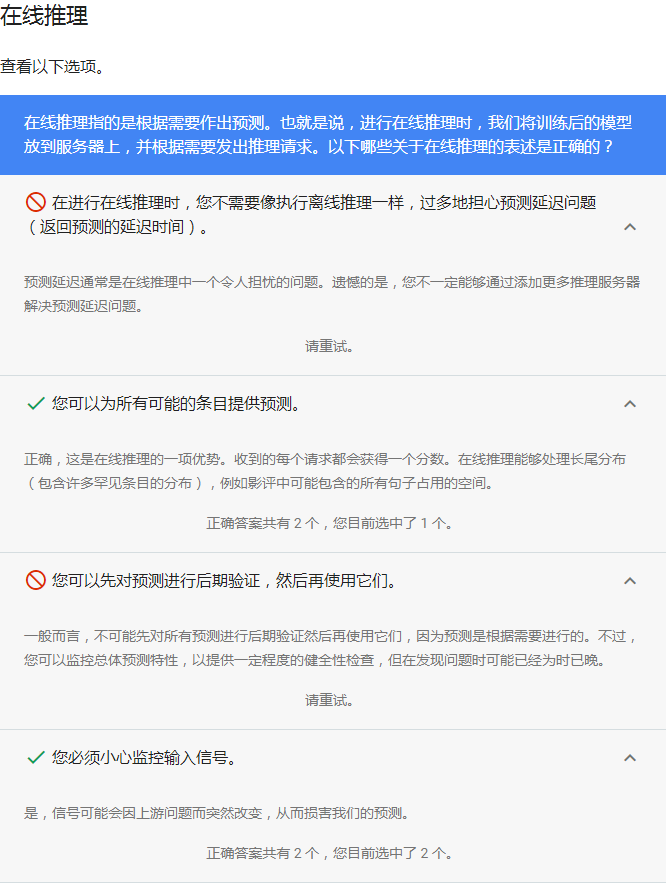
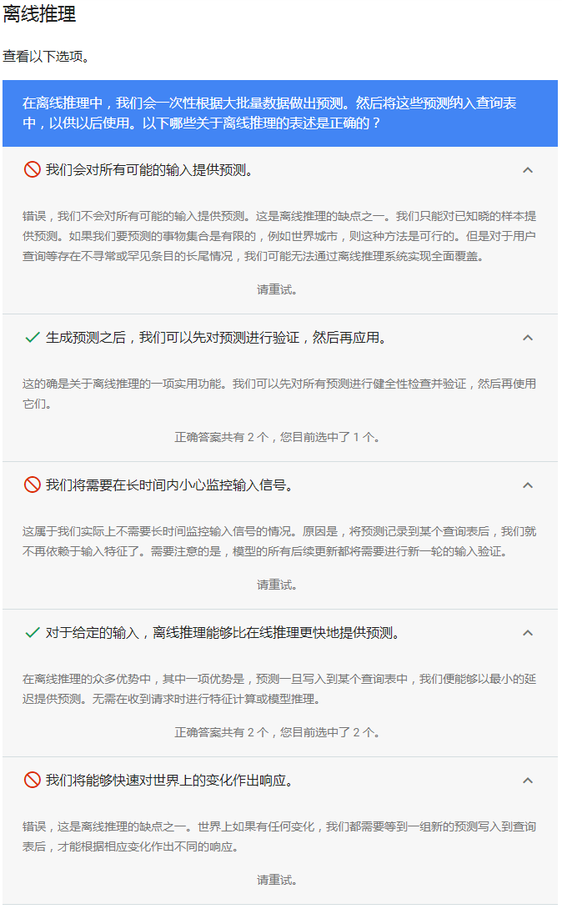

## 数据依赖关系
学习目标
+ 了解生产机器学习系统中的数据依赖关系。

机器学习系统的行为取决于其输入特征的行为和品质。当这些特征的输入数据发生更改时，您的模型也会随之变化。有时，这种变化是可取的，有时则反之。

**在传统的软件开发中，您的注意力更多地放在代码而非数据上。在机器学习开发中，虽然编码仍是工作的一部分，但您必须同时关注数据**。例如，在传统的软件开发项目中，编写单元测试来验证代码是一种最佳做法。而在机器学习项目中，您还必须不断地对输入数据进行测试、验证和监控。

例如，您应该持续监控您的模型以移除不用（或很少使用）的特征。假设某一特定特征对模型贡献很少或没有贡献。如果该特征的输入数据突然发生更改，则您模型的行为也可能会以意想不到的方式突然发生变化。

|数据依赖关系的注意项|说明|
|-|-|
|可靠性|以下是针对输入数据的可靠性询问的一些问题：信号是否始终可用？信号来源是否不可靠？例如：信号是否来自因负载过重而崩溃的服务器？信号是否来自每年 8 月去度假的人群？|
|版本控制|以下是针对版本控制询问的一些问题：计算此数据的系统是否发生过变化？如果是：多久一次？您如何知道系统发生变化的时间？有时数据来自上游进程。如果该进程突然发生变化，您的模型可能会受到影响。请考虑为从上游进程接收的数据创建您自己的副本。然后，只有当您确定这样做安全时，才跳转到下一版上游数据。|
|必要性|以下问题可以提醒您留意正则化：特征的实用性是否能证明值得添加此特征？人们往往倾向于向模型添加更多特征。例如，假设您找到一个新特征，添加该特征可让您的模型略微准确一点。较高的准确率听起来当然比较低的准确率更好。不过，现在您只是增加了自己的维护负担。添加的特征可能会意外降级，因此需要对它进行监控。在添加会带来短期利好的特征之前，请谨慎考虑。|
|相关性|某些特征会与其他特征相关联（正相关或负相关）。问问自己以下问题：是否有任何特征密不可分，以至于需要采取额外策略来梳理它们？|
|反馈环|有时，模型会影响其自身的训练数据。例如，来自某些模型的结果反过来是同一模型的直接或间接输入特征。有时，一个模型会影响另一个模型。以下列两个股价预测模型为例：模型 A - 不理想的预测模型。模型 B。由于模型 A 有误，因此会导致错误地决定购买股票 X 的股票，而购买这些股票会抬高股票 X 的价格。模型 B 将股票 X 的股价用作输入特征，因此它很容易对股票 X 的价值得出错误结论。然后，模型 B 会根据模型 A 的错误行为购买或销售股票 X 的股份，反过来，模型 B 的行为会影响模型 A，而这样很可能会触发郁金香狂热效应或导致 X 公司的股价下滑。|

### 习题


# 机器学习现实世界应用示例
## 癌症预测
学习目标
+ 确定应用于现实世界的机器学习模型中的缺陷。


答案：标签泄露问题
## 18世纪文学
学习目标
+ 确定应用于现实世界的机器学习实验性设计中的缺陷。


答案：拆分数据时出现错误。数据拆分方式A错误，B正确。
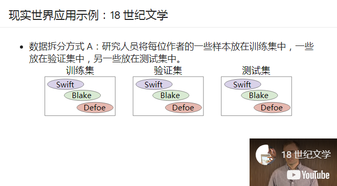
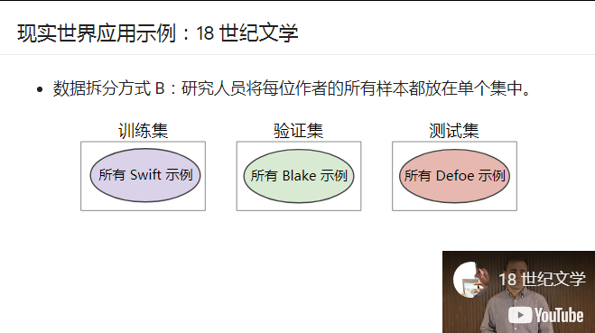
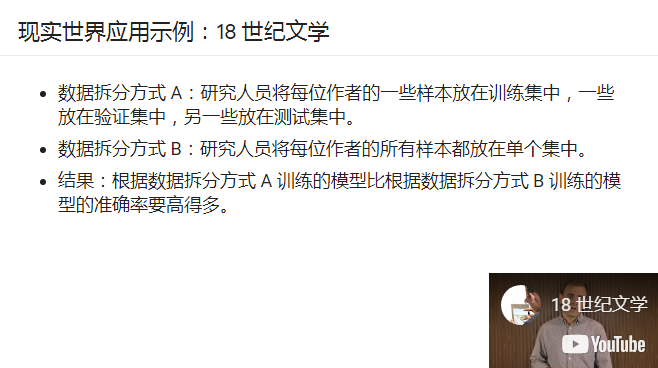
结论：仅仅随机化拆分数据是不够的，应该仔细考虑如何拆分样本，了解数据代表的含义。
## 现实世界应用准则
下面简要说明了有效的机器学习准则：
+ 确保第一个模型简单易用。
+ 着重确保数据管道的正确性。
+ 使用简单且可观察的指标进行训练和评估。
+ 拥有并监控您的输入特征。
+ 将您的模型配置视为代码：进行审核并记录在案。
+ 记下所有实验的结果，尤其是“失败”的结果。
### 其他资源
机器学习规则包含更多指导。
[机器学习规则（网页版）](https://developers.google.com/machine-learning/guides/rules-of-ml/)
[机器学习规则（PDF）](Google机器学习速成课程相关PDF资源/机器学习规则GoogleDevelopers.pdf)

# 总结
要继续机器学习培训，进一步巩固您的 TensorFlow 技能，请查看以下资源：

|资源名称|说明|
|-|-|
|机器学习实践课程|https://developers.google.com/machine-learning/practica/|
|[深度学习](https://cn.udacity.com/course/intro-to-tensorflow-for-deep-learning--ud187)|关于神经网络的机器学习高级课程，对图片和文字模型进行了广泛的介绍。|
|[机器学习规则](https://developers.google.com/machine-learning/guides/rules-of-ml/)|关于机器学习工程的最佳做法。|
|[TensorFlow.js](https://js.tensorflow.org/)|采用 WebGL 加速技术且基于浏览器的 JavaScript 库，用于训练和部署机器学习模型。|
|TensorFlow|https://www.tensorflow.org |
|参加 Kaggle 大赛|已准备好开始运用新掌握的机器学习技能来应对数据科学领域面临的现实挑战了吗？ 您可以在 [Kaggle](https://www.kaggle.com/) 上的众多比赛中一试身手！|
