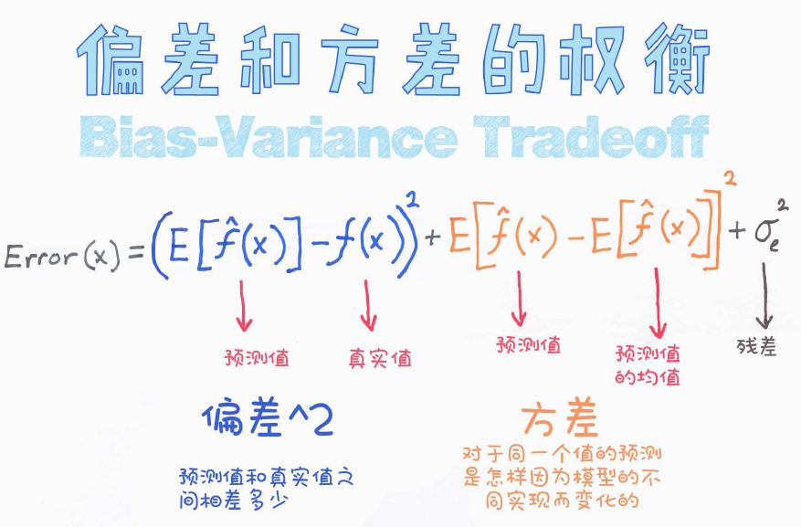
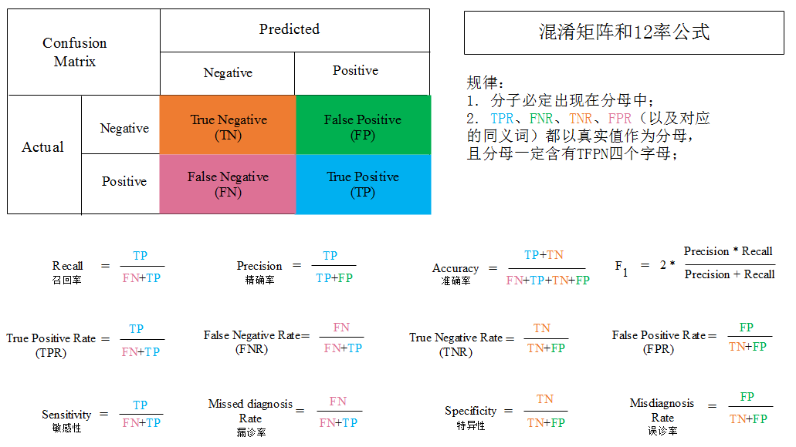
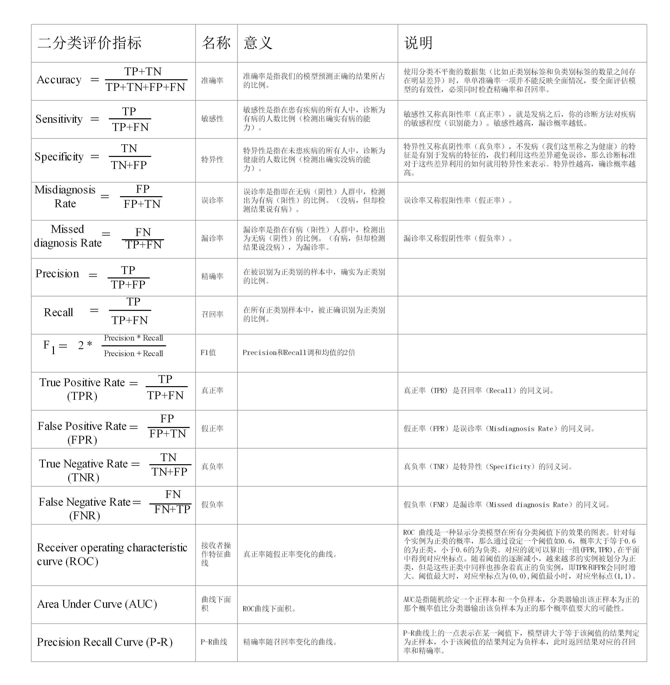

# Machine-Learning-Book
[Machine-Learning-Book（机器学习宝典）](https://github.com/yuanxiaosc/Machine-Learning-Book)涵盖了从机器学习从入门到精通所需的所有必备知识。

1. 其中《[机器学习知识点彩图版.pdf](https://raw.githubusercontent.com/yuanxiaosc/Machine-Learning-Book/master/PDF/机器学习知识点彩图版.pdf)》以生动形象的图片描述机器学习中的知识点。
2. 其中《[Google机器学习速成课程.pdf](https://raw.githubusercontent.com/yuanxiaosc/Machine-Learning-Book/master/PDF/Google机器学习速成课程.pdf)》以加利福尼亚房价预测为线索，讲解了机器学习概念、特征工程以及机器学习在现实世界的应用。该课程有对应知识点的习题和解答，你可以随时检测自己的学习效果。
3. 其中《[机器学习中的常识性问题 (最新网页版)](https://yuanxiaosc.github.io/2019/08/16/机器学习中的常识性问题/)》 ， 该文系统性总结了机器学习基础知识。比如你了解机器学习中常见的二分类问题评价指标：混淆矩阵、准确率、精确率、召回率、敏感性、特异性、AUC、ROC以及它们之间的关系吗？（答案见文末）

机器学习彩图版-偏差和方差的权衡

## 机器学习宝典内容汇总
百度网盘打包下载本资源：
+ 链接：https://pan.baidu.com/s/1OLscfquhYKOuN7X-QVqQNA
+ 提取码：6g4l

|标签|名称|说明|
|-|-|-|
|养兴趣|[机器学习知识点彩图版.pdf](https://raw.githubusercontent.com/yuanxiaosc/Machine-Learning-Book/master/PDF/机器学习知识点彩图版.pdf)|以生动形象的图片描述机器学习中的知识点。|
|练招式|完整版[Google机器学习速成课程.md](Google机器学习速成课程.md) or [Google机器学习速成课程.pdf](PDF/Google机器学习速成课程.pdf) and [谷歌机器学习速成课程-配套TensorFlow代码](Google机器学习速成课程Code)|本文讲解了机器学习概念、特征工程以及机器学习在现实世界的应用。解决了：加利福利亚房价预测问题（回归问题）+分类问题+手写字体识别问题|
|口诀|[机器学习术语表（PDF）](https://raw.githubusercontent.com/yuanxiaosc/Machine-Learning-Book/master/PDF/机器学习术语表GoogleDevelopers.pdf) or [机器学习术语表（网页版）]( https://developers.google.com/machine-learning/glossary/ ) |本术语表中列出了一般的机器学习术语和 TensorFlow 专用术语的定义。|
|心得|[机器学习规则（PDF）](https://raw.githubusercontent.com/yuanxiaosc/Machine-Learning-Book/master/PDF/机器学习规则GoogleDevelopers.pdf) or [机器学习规则（网页版）]( https://developers.google.com/machine-learning/guides/rules-of-ml/ ) |本文档旨在帮助已掌握机器学习基础知识的人员从 Google 机器学习的最佳实践（经验）中受益。|
|练内功|[机器学习中的常识性问题（PDF）](PDF/机器学习中的常识性问题_望江人工智库.pdf) or [机器学习中的常识性问题 (最新网页版)](https://yuanxiaosc.github.io/2019/08/16/机器学习中的常识性问题/)| 系统性深入学习机器学习。机器学习中的常识性问题定义：作为一名合格的机器学习从业人员必须理解的机器学习领域的常识性问题。|

## 开始学习 练招式

点击开始学习完整版 [Google机器学习速成课程.md](Google机器学习速成课程.md)，也可以下载完整版[Google机器学习速成课程.pdf](https://raw.githubusercontent.com/yuanxiaosc/Machine-Learning-Book/master/PDF/Google机器学习速成课程.pdf)。

## 学习进阶 练内功
机器学习中的常识性问题定义：作为一名合格的机器学习从业人员必须理解的机器学习领域的常识性问题。

点击开始学习 [机器学习中的常识性问题](https://yuanxiaosc.github.io/2019/08/16/机器学习中的常识性问题/)

机器学习中常见的二分类问题评价指标：混淆矩阵、准确率、精确率、召回率、敏感性、特异性、AUC、ROC以及它们之间的关系吗？

答案：

